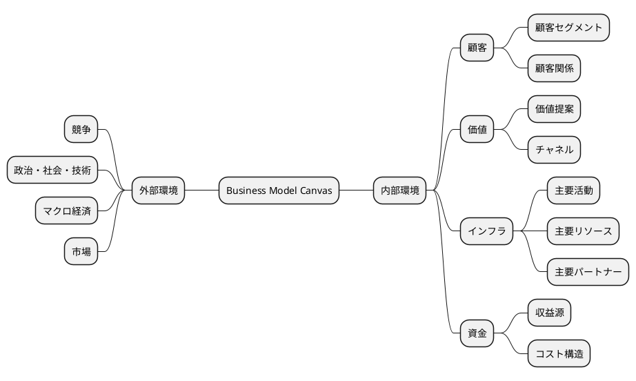

# Business Model Canvas

<link href="https://fonts.googleapis.com/css2?family=Material+Icons" rel="stylesheet"></link>

## HTML

<table>
  <tr>
    <td rowspan="2">
      <i class="material-icons">domain</i>
      <b><a href="Key_Partners.md">主要パートナー</a></b>
      
私たちの主要パートナーは誰ですか？ 
      主要な供給者は誰ですか？ 
      パートナーが実行する主要な活動は何ですか？

    </td>
    <td>
      <i class="material-icons">work</i>
      <b><a href="Key_Activities.md">主要活動</a></b>
      
私たちの価値提案にはどのような主要な活動が必要ですか？ 
      私たちの流通チャネルは？ 
      顧客との関係は？ 
      収益源は？

    </td>
    <td rowspan="2" colspan="2">
      <i class="material-icons">diamond</i>
      <b><a href="Value_Propositions.md">価値提案</a></b>
      
私たちは顧客にどのような価値を提供していますか？ 
      顧客のどの問題を解決していますか？ 
      各顧客セグメントに対して、どのような製品やサービスのバンドルを提供していますか？ 
      どの部分が他とは異なり、 
      注意を払う価値があるのですか？

           
    </td>
    <td>
      <i class="material-icons">handshake</i>
      <b><a href="Customer_Relationships.md">顧客関係</a></b>
      
各顧客セグメントが私たちと確立し、維持してほしいと期待する関係のタイプは何ですか？ 
      どのような関係を確立しましたか？

    </td>
    <td rowspan="2">
      <i class="material-icons">group</i>
      <b><a href="Customer_Segments.md">顧客セグメント</a></b>
      
私たちは誰のために価値を創造していますか？ 
      最も重要な顧客は誰ですか？

    </td>
  </tr>
  <tr>
    <td>
      <i class="material-icons">home</i>
      <b><a href="Key_Resources.md">主要リソース</a></b>
      
私たちの価値提案にはどのような主要なリソースが必要ですか？ 
      私たちの流通チャネルは？ 
      顧客との関係は？ 
      収益源は？

    </td>
    <td>
      <i class="material-icons">share</i>
      <b><a href="Channels.md">チャネル</a></b>
      
顧客セグメントはどのチャネルを通じて接触を望んでいますか？ 
      私たちのチャネルはどのように統合されていますか？
      顧客のルーチンとどのように統合されていますか？

    </td>
  </tr>
  <tr>
    <td colspan="3">
      <i class="material-icons">attach_money</i>
      <b><a href="Financial_Plan.md">コスト構造</a></b>
      
私たちのビジネスにとって最も重要なコストは何ですか？ 
      最も高価な主要リソースは何ですか？ 
      最も高価な主要活動は何ですか？ 
      ビジネスを設立し、運営するためのコストはどのように発生しますか？

    </td>
    <td colspan="3">
      <i class="material-icons">attach_money</i>
      <b><a href="Financial_Plan.md">収益源</a></b>
      
顧客は何の価値に対して支払いをするのですか？  
      彼らはどのように支払いをしたいと考えていますか？  
      収益構造は何ですか？

    </td>
  </tr>
</table>

## CSS

  <h1>Business Model Canvas</h1>
  

    

      <h3>主要パートナー</h3>
      <i class="material-icons">domain</i>
      

        私たちの主要パートナーは誰ですか？ 
        主要な供給者は誰ですか？ 
        パートナーが実行する主要な活動は何ですか？
      

    

    

      <h3>主要活動</h3>
      <i class="material-icons">work</i>
      

        私たちの価値提案にはどのような主要な活動が必要ですか？ 
        私たちの流通チャネルは？ 
        顧客との関係は？ 
        収益源は？
      

    

    

      <h3>主要リソース</h3>
      <i class="material-icons">home</i>
      

        私たちの価値提案にはどのような主要なリソースが必要ですか？ 
        私たちの流通チャネルは？ 
        顧客との関係は？ 
        収益源は？
      

    

    

      <h3>価値提案</h3>
      <i class="material-icons">diamond</i>
      

        私たちは顧客にどのような価値を提供していますか？ 
        顧客のどの問題を解決していますか？ 
        各顧客セグメントに対して、どのような製品やサービスのバンドルを提供していますか？ 
        どの部分が他とは異なり、 
        注意を払う価値があるのですか？
      

    

    

      <h3>顧客関係</h3>
      <i class="material-icons">handshake</i>
      

       各顧客セグメントが私たちと確立し、維持してほしいと期待する関係のタイプは何ですか？ 
       どのような関係を確立しましたか？
      

    

    

      <h3>チャネル</h3>
      <i class="material-icons">share</i>
      

        顧客セグメントはどのチャネルを通じて接触を望んでいますか？ 
        私たちのチャネルはどのように統合されていますか？ 
        顧客のルーチンとどのように統合されていますか？
      

    

    

      <h3>顧客セグメント</h3>
      <i class="material-icons">group</i>
      

        私たちは誰のために価値を創造していますか？ 
        最も重要な顧客は誰ですか？
      

    

    

      <h3>コスト構造</h3>
      <i class="material-icons">attach_money</i>
      

        私たちのビジネスにとって最も重要なコストは何ですか？ 
        最も高価な主要リソースは何ですか？ 
        最も高価な主要活動は何ですか？ 
        ビジネスを設立し、運営するためのコストはどのように発生しますか？
      

    

    

      <h3>収益源</h3>
      <i class="material-icons">attach_money</i>
      

        顧客は何の価値に対して支払いをするのですか？  
        彼らはどのように支払いをしたいと考えていますか？  
        収益構造は何ですか？
      

    

  

[Google Fonts](https://fonts.google.com/icons?selected=Material+Symbols+Outlined:attach_money:FILL@0;wght@400;GRAD@0;opsz@23)
[CodePen Home Business Model Canvas – CSS Grid](https://codepen.io/radioative/pen/NeqdKj)
