# 基本スキル

## ロジカルシンキング

> 達人プログラマーが取り扱う素材は木でも鉄でもありません --- 知識です。
>
>> — 達人プログラマー 熟達に向けたあなたの旅（第2版）

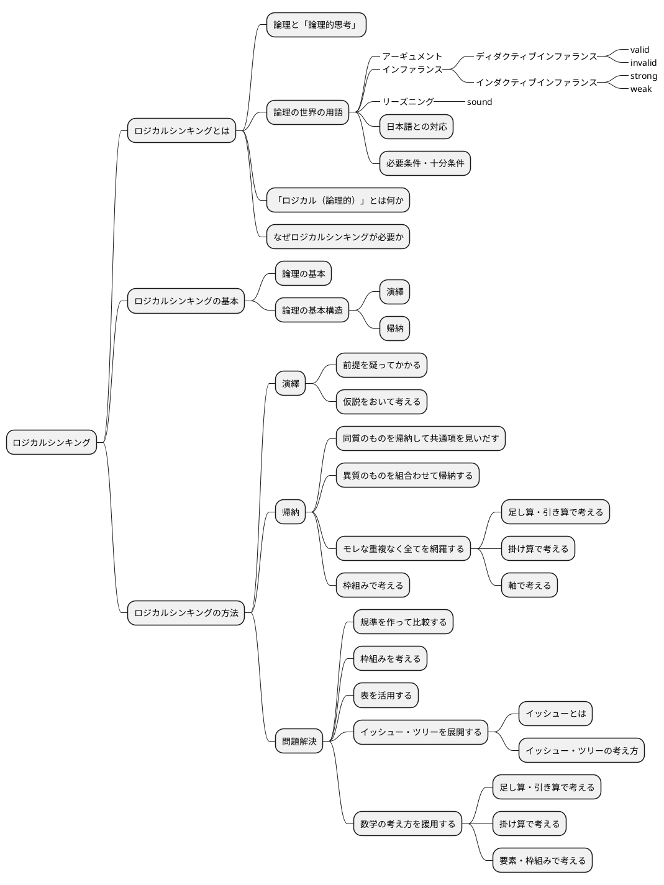

### ロジカルシンキングとは


#### 論理と「論理的思考」

> 高い論理性を身につけるとは、「結論」と「結論を支えるもの」の関係について正確な理解を獲得することなのです。
>
>> 論理思考力を鍛える本 小野田博一

> 高い論理性とは、結論と前提との関係の理解度が高く、理解している通りにそれを実践の場で使えることなのです。
>
>> 論理思考力を鍛える本 小野田博一


#### 論理の世界の用語

結論と前提の両方を含んだスティトメント(statement)をアーギュメント(argument)といいます。
「ロジック」（論理）は、結論と前提を繋ぐ無形のものです。この無形の部分はインファランス(inference)ともいいます。インファランスには2種類のものがあります。ディダクティブ・インファランス（deductive inference）とインダクティブ・インファランス（inductive inference）です。

前提から結論を導く思考のことをリーズニング（reasoning）といいます。

ディダクティブ・インファランスの評価は、valid/invalidで与えられます。validは「論理が正しい」の意味で、invalidは「論理が正しくない」の意味です。

インダクティブ・インファランスの評価は、strong/weakで与えられます。インダクティブ・インファランスは「たぶんどうだろうか」の推論なので、前提が正しくとも、得られた結論が100%確実に正しいと断言できません。

論理が正しいだけでなく、前提も（真実か否かの点から）正しい場合、評価はsoundで与えられます。

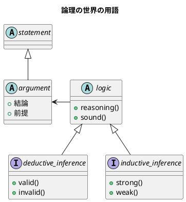

##### 日本語との対応

1. カモノハシは哺乳類である。したがって、カモノハシは、哺乳類か鳥類である。
2. 私がこれまでに食べたレモンは、どれもすっぱかった。だからレモンはどれもすっぱいだろう。
3. メガネをかけている高校生の女の子のうち、90%のメガネは黒縁である。紀子は高校生で、メガネをかけている。だから、それはたぶん黒縁だろう。
4. 春にピンクのスカートが流行した年の夏に、白い水着が流行した。ことしの春はピンクのＴシャツが流行しているから、夏には白い水着が流行するだろう。

| 番号                     | タイプ       | 日本語での呼称 |
|--------------------------|------------|--------------|
| 1 : deductive inference  | 演繹        | 演繹          |
| 2 : inductive inference  | 一般化      | 帰納          |
| 3 : inductive inference  | 統計的帰納   | 帰納          |
| 4 : inductive inference  | 類推        | 帰納        |

##### 必要条件・十分条件

###### 必要条件

AであるためにはBである必要がある（たとえば、「ペンギンであるためには、鳥である必要がある」）
BであることはAであることの必要条件である（たとえば「鳥であることはペンギンであることの必要条件である」）

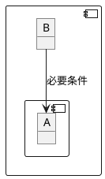

###### 十分条件

BであるためにはAであれば十分である（たとえば、「鳥であるためには、ペンギンであれば十分である」）
AであることはBであることの十分条件である（たとえば「ペンギンであることは鳥であることの十分条件である」）

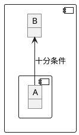

#### 「ロジカル（論理的）」とは何か

> 論理は「知識」とは関係がありません。論理は容器（のようなもの）であって知識は中身の一部です。論理の正しさは推論の形式の正しさであり、実体はありません。
>
> — 論理的に考える方法 小野田博一（著）日本実業出版社


> 「実生活の議論（のうち演繹）では、validであるだけでは十分ではなく、soundでなければならない」ということで、つまり、「前提は真実でなければならない」ということです。
>> 論理思考力を鍛える本 小野田博一

#### なぜロジカルシンキングが必要か

> なぜ論理思考が必要なのか
> 1. 情緒に流されやすい判断や行動を防ぎ、自分の頭で考えて、「正しい結論を導く」ことができること。
> 1. 文化の同一性に頼らず、どの民族にも通用する、「正しいコミュニケーションができること」こと。
> 1. 「発想を助け、課題の検討・解決に役立つ」こと。
>
>> わかる、使える「論理思考」の本


> 正しく解決するための技術
> 日本人の論理的な能力が劣るとは思わないが、「食い違った主張を、感情に流されず合理的にきちんと解決しようとする基本姿勢」には欠けているような気がする。
> その意味で、我々は問題を正しい方法で解決する努力を怠っているのではないだろうか。
>> 論理的思考と発想の技術


### ロジカルシンキングの基本

#### 論理の基本


> １つのメッセージ（結論）は、必ず2つ以上のサブ・メッセージ（要因）でサポートされてるため、論理は、底辺に行くほど広いピラミッド状に組み上げられる。
>
> わかる、使える「論理思考」の本

1. 論理の基本単位は、単語ではなく主語・述語で組み上げるメッセージである。
1. メッセージを組み上げる基本構造には「演繹」と「帰納」という2つの方法がある。
1. 上位のメッセージと、それをサポートする下位のサブ・メッセージは、結論と要因、あるいは総合と部分の関係にある（メッセージの上下関係）
1. 上位のメッセージを支える下位のメッセージは、それらを総合すると、モレや重複がないこと（水平関係）
1. 全体を支える最下部のメッセージは、事実、またはそれに近い疑いようのないメッセージ（蓋然性の高いメッセージ）であること

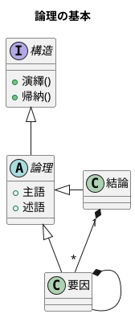

#### 論理の基本構造

##### 演繹

Deduction(演繹)は、前提となる正しいメッセージ（一般論）がまずあり、それを個別の事象に適用して、正しい主張・答を引き出す方法で「一般論」から「個別論」へという構造になっている

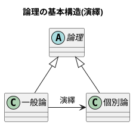

##### 帰納

Induction(帰納)は、たくさんの個別の事象や主張を集めて、より一般的に通用する共通のメッセージを導き出す方法で「個別論」から「一般論」へという構造になっている

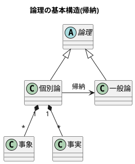

### ロジカルシンキングの方法

#### 演繹

##### 前提を疑ってかかる

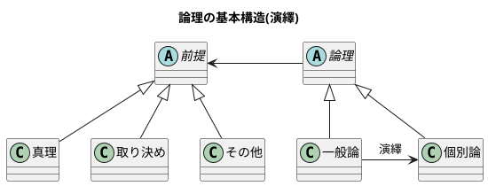

##### 仮説をおいて考える

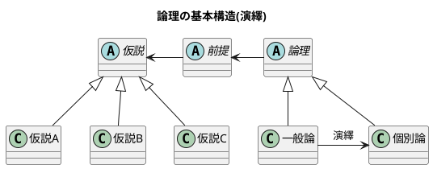

#### 帰納

##### 同質のものを帰納して共通項を見いだす

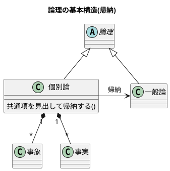

##### 異質のものを組合わせて帰納する

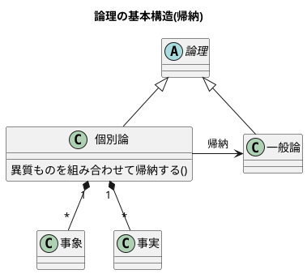

##### モレな重複なく全てを網羅する

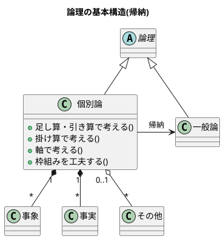

###### 足し算・引き算で考える

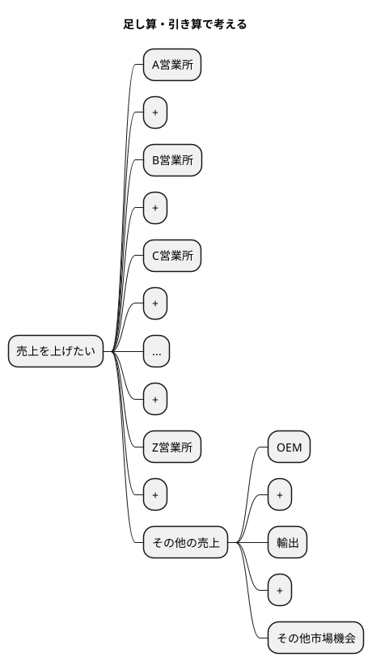

```math
可能な全売上機会 - 現行の各営業所の売上の合計 = その他
```

###### 掛け算で考える

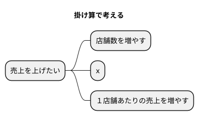

```math
店舗数 \times １店舗あたりの売上 = 全体の売上
```

###### 軸で考える

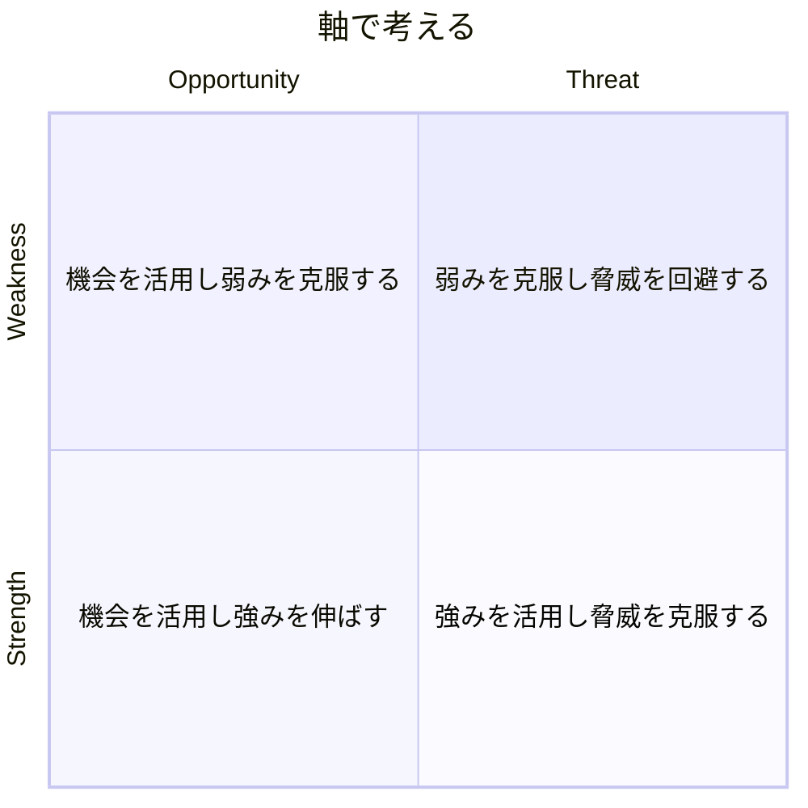

##### 枠組みで考える


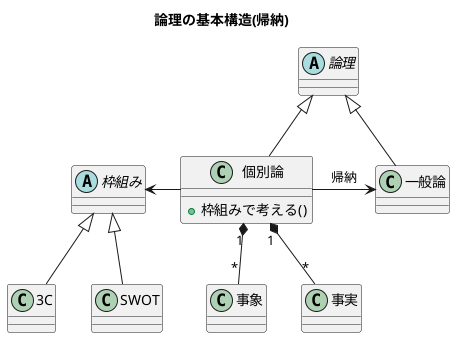

#### 問題解決

##### 規準を作って比較する

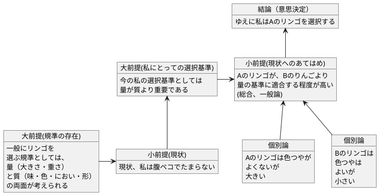

##### 枠組みを考える

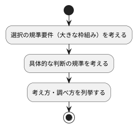

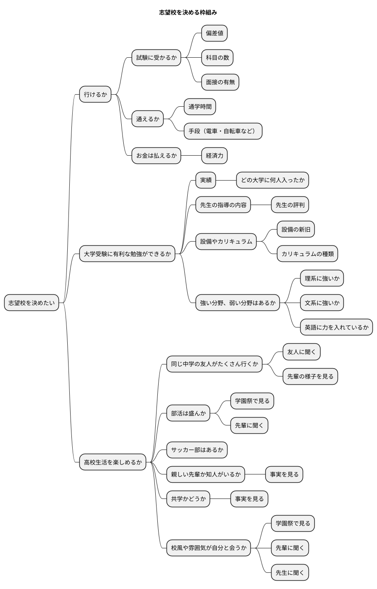

##### 表を活用する

| 規準 | 学校A | 学校B | 学校C |
| ---- | ---- | ---- | ---- |
| 通学時間 | 30分 | 45分 | 1時間 |
| 手段 | 電車 | 自転車 | 徒歩 |
| 経済力 | 可能 | 可能 | 難しい |
| 実績 | 〇 | △ | × |
| 先生の評判 | 良い | 普通 | 悪い |
| 設備の新旧 | 新しい | 古い | 新しい |
| カリキュラムの種類 | 理系 | 文系 | 総合 |
| 強い分野 | 理系 | 文系 | 英語 |
| 高校生活 | 楽しい | 普通 | 退屈 |
| 部活 | 盛ん | 普通 | あまりない |
| サッカー部 | あり | なし | あり |
| 共学 | あり | なし | あり |
| 校風 | 自由 | 厳格 | 普通 |
|総合評価| ◎ | △ | × |


##### イッシュー・ツリーを展開する

###### イッシューとは

###### イッシュー・ツリーの考え方

> イッシュー・ツリーの考え方
> 実は、イッシューは「ロジックの動的展開」であって、構造上の本質はロジックと全く同じものである。
> ただし、ロジックは「あるメッセージ（命題）」を正しく主張するために、最下部の事実からピラミッドの頂点へと積み上げる構造になっているのに対して、イッシューを追求する過程は、逆に争点からはじめて、それを解決するためのより具体的な疑問へと、サブ・イッシューに分解し、ついに事実に突き当たって解決をみるところに違いがある。
>> 論理的思考と発想の技術

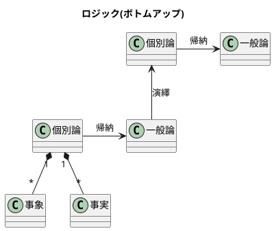

```plantuml
@startuml

title イッシュー(トップダウン)

class "一般論" as A

class "個別論" as B

class "事象" as C

class "事実" as D

A --> B : 演繹

B "1" *-- "*" C

B "1" *-- "*" D

class "一般論" as E

B -> E : 帰納

class "個別論" as F

class "事実" as G

E --> F : 演繹

F "1" *-- "*" G


@enduml
```

- イッシュー・ツリーはロジックの動的展開であり、 MECE、抽象レベル、事実のサポート等の諸要件は共通である。
- イッシュー・ツリーは、未解決の課題（争点）を合理的に解明し、正しい結論を導くための枠組みであり、最後に事実を求めて初めて結果に結びつく。
- プロジェクトチームを効果的に運用するためには、イッシュー・ツリーが不可欠である。
- イッシュー・ツリーの展開はいろいろあり、巧拙がある。訓練して身につけるほかはない。
- 頭で考えるより、直接観察したりデータを手に取る事によって、より効果的なイッシューの展開が期待できる。


```plantuml
@startmindmap
title ラーメン店を開くかどうかのイッシュー・ツリー

* ラーメン店を開くべきか否か
** ラーメン店を開いて運営する能力があるか否か(company)
*** 人がいるか
*** お金があるか
*** ラーメンをつくる技術をもっているか
*** 材料や設備は手に入るか
*** ...
*** その他ラーメン店を運営する要件を満たせるか
** 市場は十分に大きいか(customer)
*** 人口はどれだけか
*** 交通量は十分か
*** ラーメンを外食する人が期待できる構成か
** 有力な競争相手がいるか否か(competitor)
*** 競合店が近くにあるか
**** ある場所、距離は十分に遠いか
**** 味・店構え・ロケーションなど自分に比べて優位か否か
*** ラーメン以外の外食店があるか、どんな店か
*** (競合がある場合)集客などかえって相乗効果を期待することはできないか
@endmindmap
```

##### 数学の考え方を援用する

```plantuml
@startuml
object "売り上げが低下した" as A 
object "売上を上げれるか" as B 

A -> B
@enduml
```


###### 足し算・引き算で考える

```plantuml
@startmindmap
title 足し算・引き算

* 地域等で分ける
** 札幌営業所の売上を上げられるか
** 仙台営業所の売上を上げられるか
** 北関東営業所の売上を上げられるか
** 東京営業所の売上を上げられるか
** ...
** その他、売上を上げらる機会はないか
*** 輸出
*** OEM
*** 他チャネル

@endmindmap
```


###### 掛け算で考える

```plantuml
@startmindmap
title 掛け算


+ x
-- 店舗数
--- 増やせるか
---- 交通量・ロケーションの特徴
---- 人口密度・地域需要
---- 基本エコノミクスの構造など
++ １店舗あたりの売上
+++ 客数を増やせるか
++++ キャンペーン・特売
++++ 広告・ちらし
++++ 店構え・その他
+++ x
+++ 客単価を増やせるか
++++ 品揃え
++++ レイアウト
++++ セット販売
++++ その他

@endmindmap
```


###### 要素・枠組みで考える

```plantuml
@startmindmap
title 要素・枠組み

* 売上が低下した理由の検討
** 全国共通の要因はあるか 
*** 全国共通の製品・価格・マーケティング施策等の工夫
** 個店別の要因が大きいか
*** 業績低下の大きい店への個別指導等
** 季節性の課題が大きいか
*** 冬に売れる商品の開発（冬に低下なら）
** その他

@endmindmap
```

## クリティカルシンキング

> 重要な点の最後は、あなたが見聞きするものごとについての批判的な考え方です。
> Tip 10 見聞きしたものごとを批判的な目で分析すること
>
>> 達人プログラマー

```plantuml
@startmindmap

* クリティカルシンキング
** クリティカルシンキングとは
*** 批判的に読み、批判的に聞く
*** クリティカルシンキングとロジカルシンキングの違い
** クリティカルシンキングの基本
*** クリティカルシンキングのポイント
*** クリティカルシンキングの手順
*** クリティカルシンキングのコツ
** クリティカルシンキングの実践
*** 「もっともらしさ」
*** アーギュメントの欠陥
*** 最も強い反論
*** 説得の基本
****_ 論理
****_ 感情へのアピール
****_ 信頼性
*** 説得するため5つのステップ
*** 批判と非難は違う

@endmindmap
```

### クリティカルシンキングとは

#### 批判的に読み、批判的に聞く

> 実生活の場において、読むとき、聞くときに行っている（行うべき）「批判的に読み、批判的に聞く」ための思考を、クリティカル・シンキングと言います。
>> 論理思考力を鍛える本 小野田博一

> 「実生活の場で、論理が正しいのか、前提は正しいのか、の2点を考える」とは言い換えると、「アーギュメントを鵜呑みにせず、アーギュメントの正しさを自力で考える」ことです。
>> 論理思考力を鍛える本 小野田博一


#### クリティカルシンキングとロジカルシンキングの違い

> クリティカル・シンキングとロジカル・シンキングの違い
>
> 論理的に考えることと批判的に考えることは、基本的に同じで、ただ若干の違いは「クリティカル・シンキングの話題は日常生活のみで、ロジカル・シンキングのほうはそのような限定はない」くらいのものと言ってよいでしょう。
>
> — 論理的に考える方法 小野田博一（著）日本実業出版社


### クリティカルシンキングの基本

#### クリティカルシンキングのポイント

> なぜクリティカル・シンキングが必要なのかと言えば、それは、読み聞きした内容で「相手のいいように操られないため」「間違った判断を下さないため」です。
>> 論理思考力を鍛える本 小野田博一

> クリティカル・シンキングのポイントは「むやみに信じないこと」です。つまり「信じるにたる根拠がないかぎり信じるな」です。
>> 論理思考力を鍛える本 小野田博一

> 「自分自身の判断力を使って判断する」とは、「前提と結論のつながりの正しさや支えかたの強度」を自分自身で判断することで、具体的には、結論が正しく導き出されているか、しっかり支えられているか、および情報そのものの信頼性を考えることです。
>> 論理思考力を鍛える本 小野田博一


#### クリティカルシンキングの手順

```plantuml
@startuml
start
:結論を見つけよ;
:支えている（つもりの）ものを見つけよ;
:支えているつもりのものの信頼性を判断せよ;
:支えているつもりのものが十分支えているかー支えている程度の十分さを調べよ;
if (隠れているアサンプションがある？) then (yes)
  :アサンプションは正しい？;
endif
stop
@enduml
```


> このような「当然正しい」と考えられている事柄をー明言されていようといまいとー英語ではアサンプション(assumption)と言います。
>
> — 論理的に考える方法 小野田博一（著）日本実業出版社


> 前提から結論を導く思考のことをリーズニング（reasoning）といいます。
>
> — 論理的に考える方法 小野田博一（著）日本実業出版社

```plantuml
@startuml

title 論理の世界の用語

abstract "statement" as A {
}

abstract "argument" as B {
  + 結論
  + 前提
}

abstract "logic" as C {
  + reasoning()
  + sound()
}

interface "deductive_inference" as D {
  + valid()
  + invalid()
}

interface "inductive_inference" as E {
  + strong()
  + weak()
}

abstract "assumption" as F

F -* B
A <|-- B
B <- C
C <|-- D
C <|-- E

@enduml
```


#### クリティカルシンキングのコツ

1. 隠れているアサンプションが何かを考えよ
1. リーズニングのフォーム（形式）を考えよ

> 日常的には、多くの場合、発言が論理的か否かはアサンプションが正しいか否かにかかっています。
>
> — 論理的に考える方法 小野田博一（著）日本実業出版社


### クリティカルシンキングの実践

#### 「もっともらしさ」

> 実生活では、断言できないことがとてもたくさんあります。私たちが話したり書いたりする内容は、ほとんど断言できないことばかりです。そのため、「もっともらしさ」は実生活では大きな役割を果たす事になります。
> そして、クリティカル・シンキンキングは、「もっともらしさ」をあなた自身が検証する事なのです。
>
> — 論理的に考える方法 小野田博一（著）日本実業出版社

##### 議論では、もっともらしさを高めるよう努力せよ

> 人を納得させるのは「真実」ではなく「真実らしさ」（もっともらしさ）です。
>
> — 論理的に考える方法 小野田博一（著）日本実業出版社


#### アーギュメントの欠陥

- 早まった一般化
- 原因・結果の間違い
- 間違った類比
- 権威の間違った使用
- あいまいな表現
- 立証責任の転嫁
- 循環論法
- 聞き手・読み手の感情の利用
- 個人攻撃
- 矛盾
- 一般の意見の使用
- 統計の悪用（歪めた使用）


#### もっとも強い反論

> もっとも強い反論は、もとの議論のアサンプションをアタックする議論です。
>
> — 論理的に考える方法 小野田博一（著）日本実業出版社


#### 説得の基本

> 説得に必要な要素は三つあります。それは
> 1 論理
> 2 感情へのアピール
> 3 信頼性
> の三つです。
> 説得をする際に重要となるのは、「説得は一方的に行うものではない。つまり、説得ではコミュニケーションに双方向性がなけらならない」という点です。
>
> 説得とは、人に影響を与えるという目的を持ったコミュニケーションのプロセス」と言うことができます。
>
> 論理的に説得する方法


#### 説得するための５つのステップ


#### 批判と非難は違う

> 人を非難したり、煽ったりするのは、後々、自分に返ってくるのでやめましょう。面と向かって言わないようなことを、オンラインで表現してはいけません。
>
> — 達人プログラマー 熟達に向けたあなたの旅（第2版）


## まとめ

```plantuml
@startuml

object "結論" as A {
	論理的思考の実践である
  ロジカル・クリティカルシンキングは
	実践プログラマの基本スキルである
}
object "小前提" as B {
	論理的思考は取得可能なスキルであり
	論理的思考は知識を扱うプログラマにとって
	キャリアの始まりから終わりまで
	あらゆる局面で役に立つ。
}
object "大前提" as C {
	論理的思考を身に着けることで
	「正しい結論を導くことができる」こと。
	「正しいコミュニケーションができること」こと。
	「発想を助け、課題の検討・解決に役立つ」こと。
  ができるようになる。
}
A <-- B
C -> B

object "個別論" as B_1 {
   達人プログラマーが取り扱う
	 素材は木でも鉄でもありません
   --- 知識です。
}
object "個別論" as B_2 {
   重要な点の最後は、
	 あなたが見聞きするものごとについての
	 批判的な考え方です。
}
object "個別論" as B_3 {
	１つのメッセージ（結論）は、
	必ず2つ以上のサブ・メッセージ（要因）
	でサポートされてるため、
	論理は、底辺に行くほど
	広いピラミッド状に組み上げられる。
}
object "個別論" as B_4 {
	Deduction(演繹)は、前提となる
	正しいメッセージ（一般論）
	がまずあり、それを個別の事象に適用して、
	正しい主張・答を引き出す方法で
	「一般論」から「個別論」へという
	構造になっている
}
object "個別論" as B_5 {
	Induction(帰納)は、たくさんの
	個別の事象や主張を集めて、
	より一般的に通用する共通の
	メッセージを導き出す方法で
	「個別論」から「一般論」へ
	という構造になっている
}

B <-- B_1
B <-- B_2
B <-- B_3
B <-- B_4
B <-- B_5

@enduml
```


## 引用文献

- [わかる、使える「論理思考」の本 日本一わかりやすい授業、開講！](https://www.amazon.co.jp/%E3%82%8F%E3%81%8B%E3%82%8B%E3%80%81%E4%BD%BF%E3%81%88%E3%82%8B%E3%80%8C%E8%AB%96%E7%90%86%E6%80%9D%E8%80%83%E3%80%8D%E3%81%AE%E6%9C%AC-%E6%97%A5%E6%9C%AC%E4%B8%80%E3%82%8F%E3%81%8B%E3%82%8A%E3%82%84%E3%81%99%E3%81%84%E6%8E%88%E6%A5%AD%E3%80%81%E9%96%8B%E8%AC%9B%EF%BC%81-%E5%BE%8C-%E6%AD%A3%E6%AD%A6-ebook/dp/B08R37L3YW/ref=sr_1_19?__mk_ja_JP=%E3%82%AB%E3%82%BF%E3%82%AB%E3%83%8A&crid=3156JV5HPZEFX&dib=eyJ2IjoiMSJ9.ocNw5tu0DCBoGPWIQJTlmv1Xb70wAzx3bHNNancrp1W0jWFsbP7ASED88N7rQs6jYWd0aSQrwUxjLZDCQD9EyHdrptHE9GdXOBiI7GTP0oBnhW21BDCsmvKdwfMagGAzgO3FKz0kDMznkB3lTUja29LR2nTXUEsz04nUZcfRoHU.VMAXgoRwztIqOFXDyTh2-C4ts1PRGzV4h-jw8Mu1-tc&dib_tag=se&keywords=%E8%AB%96%E7%90%86%E7%9A%84%E3%81%AB%E8%80%83%E3%81%88%E3%82%8B&qid=1710392290&s=books&sprefix=%E8%AB%96%E7%90%86%E7%9A%84%E3%81%AB%E8%80%83%E3%81%88%E3%82%8B%E6%96%B9%E6%B3%95%2Cstripbooks%2C173&sr=1-19)

- [経営参謀が明かす論理思考と発想の技術](https://www.amazon.co.jp/%E7%B5%8C%E5%96%B6%E5%8F%82%E8%AC%80%E3%81%8C%E6%98%8E%E3%81%8B%E3%81%99%E8%AB%96%E7%90%86%E6%80%9D%E8%80%83%E3%81%A8%E7%99%BA%E6%83%B3%E3%81%AE%E6%8A%80%E8%A1%93-%E7%9F%A5%E5%8A%9B%E3%82%A2%E3%83%83%E3%83%97%E8%AC%9B%E5%BA%A7-%E5%BE%8C-%E6%AD%A3%E6%AD%A6/dp/4833416646/?_encoding=UTF8&pd_rd_w=RrqOp&content-id=amzn1.sym.283d32d1-edfb-4c41-92c4-67698624ee7b&pf_rd_p=283d32d1-edfb-4c41-92c4-67698624ee7b&pf_rd_r=356-2306096-5319855&pd_rd_wg=td1mD&pd_rd_r=61a3b052-5275-42b2-9e99-d157eb967f76&ref_=aufs_ap_sc_dsk)

- [論理的に考える方法: 判断力がアップし本質への筋道が読める](https://www.amazon.co.jp/%E8%AB%96%E7%90%86%E7%9A%84%E3%81%AB%E8%80%83%E3%81%88%E3%82%8B%E6%96%B9%E6%B3%95%E2%80%95%E5%88%A4%E6%96%AD%E5%8A%9B%E3%81%8C%E3%82%A2%E3%83%83%E3%83%97%E3%81%97%E6%9C%AC%E8%B3%AA%E3%81%B8%E3%81%AE%E7%AD%8B%E9%81%93%E3%81%8C%E8%AA%AD%E3%82%81%E3%82%8B-%E5%B0%8F%E9%87%8E%E7%94%B0-%E5%8D%9A%E4%B8%80/dp/4534028075?ref_=ast_author_dp&dib=eyJ2IjoiMSJ9.OrfP_uEuPCoK_CAe7_NK3DHeDiVvisHa9dBuFp-r-FKwaQPzV93gwxXAY6pHf_GAAXsSWCL-VrbbdEr-1ppiEH3Rk1eKOEreTM1EWnaeGPOqzfh6LXYVTmEy-dnZ_bJSiNzhA71VAmresFIVApJNY3xFteBtghW4P0a7Wyv8QYnw1z2FGc6pIqAyrMc8I8e82iBKIXjBoCgfdRe0tDygN5qg2-PQFFOy83u5Qmbm7I4.vyVjugiYeOjCVpBZ5DOPPFZxQ7VbycmctN1HLIy5TyQ&dib_tag=AUTHOR)
  
- [論理思考力を鍛える本: 問題演習](https://www.amazon.co.jp/%E8%AB%96%E7%90%86%E6%80%9D%E8%80%83%E5%8A%9B%E3%82%92%E9%8D%9B%E3%81%88%E3%82%8B%E6%9C%AC%E2%80%95%E5%95%8F%E9%A1%8C%E6%BC%94%E7%BF%92-%E5%B0%8F%E9%87%8E%E7%94%B0-%E5%8D%9A%E4%B8%80/dp/4534034504?ref_=ast_author_dp&dib=eyJ2IjoiMSJ9.OrfP_uEuPCoK_CAe7_NK3DHeDiVvisHa9dBuFp-r-FKwaQPzV93gwxXAY6pHf_GAAXsSWCL-VrbbdEr-1ppiEH3Rk1eKOEreTM1EWnaeGPOqzfh6LXYVTmEy-dnZ_bJSiNzhA71VAmresFIVApJNY3xFteBtghW4P0a7Wyv8QYnw1z2FGc6pIqAyrMc8I8e82iBKIXjBoCgfdRe0tDygN5qg2-PQFFOy83u5Qmbm7I4.vyVjugiYeOjCVpBZ5DOPPFZxQ7VbycmctN1HLIy5TyQ&dib_tag=AUTHOR)

- [論理的に説得する方法: 納得させてYESを引き出す](https://www.amazon.co.jp/%E8%AB%96%E7%90%86%E7%9A%84%E3%81%AB%E8%AA%AC%E5%BE%97%E3%81%99%E3%82%8B%E6%96%B9%E6%B3%95%E2%80%95%E7%B4%8D%E5%BE%97%E3%81%95%E3%81%9B%E3%81%A6YES%E3%82%92%E5%BC%95%E3%81%8D%E5%87%BA%E3%81%99-%E5%B0%8F%E9%87%8E%E7%94%B0-%E5%8D%9A%E4%B8%80/dp/4534029934?ref_=ast_author_dp&dib=eyJ2IjoiMSJ9.OrfP_uEuPCoK_CAe7_NK3DHeDiVvisHa9dBuFp-r-FKwaQPzV93gwxXAY6pHf_GAAXsSWCL-VrbbdEr-1ppiEH3Rk1eKOEreTM1EWnaeGPOqzfh6LXYVTmEy-dnZ_bJSiNzhA71VAmresFIVApJNY3xFteBtghW4P0a7Wyv8QYnw1z2FGc6pIqAyrMc8I8e82iBKIXjBoCgfdRe0tDygN5qg2-PQFFOy83u5Qmbm7I4.vyVjugiYeOjCVpBZ5DOPPFZxQ7VbycmctN1HLIy5TyQ&dib_tag=AUTHOR)

- [達人プログラマー(第2版): 熟達に向けたあなたの旅](https://www.amazon.co.jp/%E9%81%94%E4%BA%BA%E3%83%97%E3%83%AD%E3%82%B0%E3%83%A9%E3%83%9E%E3%83%BC-%E7%AC%AC2%E7%89%88-%E7%86%9F%E9%81%94%E3%81%AB%E5%90%91%E3%81%91%E3%81%9F%E3%81%82%E3%81%AA%E3%81%9F%E3%81%AE%E6%97%85-David-Thomas/dp/4274226298/ref=pd_sbs_1?pd_rd_w=dGuvs&pf_rd_p=e0138d67-9e5b-487b-a2c3-be9ff3010069&pf_rd_r=FQTQBJZRDASV3DCJPQJB&pd_rd_r=400067c3-dc6c-4e86-966e-79474f3ab44f&pd_rd_wg=oB0uI&pd_rd_i=4274226298&psc=1)


- [リーダブルコード ―より良いコードを書くためのシンプルで実践的なテクニック (Theory in practice)](https://www.amazon.co.jp/%E3%83%AA%E3%83%BC%E3%83%80%E3%83%96%E3%83%AB%E3%82%B3%E3%83%BC%E3%83%89-%E2%80%95%E3%82%88%E3%82%8A%E8%89%AF%E3%81%84%E3%82%B3%E3%83%BC%E3%83%89%E3%82%92%E6%9B%B8%E3%81%8F%E3%81%9F%E3%82%81%E3%81%AE%E3%82%B7%E3%83%B3%E3%83%97%E3%83%AB%E3%81%A7%E5%AE%9F%E8%B7%B5%E7%9A%84%E3%81%AA%E3%83%86%E3%82%AF%E3%83%8B%E3%83%83%E3%82%AF-Theory-practice-Boswell/dp/4873115655/ref=sr_1_1?__mk_ja_JP=%E3%82%AB%E3%82%BF%E3%82%AB%E3%83%8A&dchild=1&keywords=%E3%83%AA%E3%83%BC%E3%83%80%E3%83%96%E3%83%AB%E3%82%B3%E3%83%BC%E3%83%89&qid=1619404078&s=books&sr=1-1)


- [現場で役立つシステム設計の原則 ~変更を楽で安全にするオブジェクト指向の実践技法](https://www.amazon.co.jp/dp/477419087X)

- [アジャイルソフトウェア開発の奥義 第2版 オブジェクト指向開発の神髄と匠の技](https://www.amazon.co.jp/dp/4797347783)

- [プリンシプル オブ プログラミング 3年目までに身につけたい 一生役立つ101の原理原則](https://www.amazon.co.jp/%E3%83%97%E3%83%AA%E3%83%B3%E3%82%B7%E3%83%97%E3%83%AB-%E3%82%AA%E3%83%96-%E3%83%97%E3%83%AD%E3%82%B0%E3%83%A9%E3%83%9F%E3%83%B3%E3%82%B0-3%E5%B9%B4%E7%9B%AE%E3%81%BE%E3%81%A7%E3%81%AB%E8%BA%AB%E3%81%AB%E3%81%A4%E3%81%91%E3%81%9F%E3%81%84-%E4%B8%80%E7%94%9F%E5%BD%B9%E7%AB%8B%E3%81%A4101%E3%81%AE%E5%8E%9F%E7%90%86%E5%8E%9F%E5%89%87-ebook/dp/B071V7MY82/ref=sr_1_3?__mk_ja_JP=%E3%82%AB%E3%82%BF%E3%82%AB%E3%83%8A&dchild=1&keywords=%E3%83%AA%E3%83%BC%E3%83%80%E3%83%96%E3%83%AB%E3%82%B3%E3%83%BC%E3%83%89&qid=1619404078&s=books&sr=1-3)

- [テスト駆動開発](https://www.amazon.co.jp/dp/4274217884)

- [新装版 リファクタリング―既存のコードを安全に改善する― (OBJECT TECHNOLOGY SERIES) ](https://www.amazon.co.jp/dp/427405019X)

- [リファクタリング(第2版): 既存のコードを安全に改善する (OBJECT TECHNOLOGY SERIES)](https://www.amazon.co.jp/%E3%83%AA%E3%83%95%E3%82%A1%E3%82%AF%E3%82%BF%E3%83%AA%E3%83%B3%E3%82%B0-%E7%AC%AC2%E7%89%88-%E6%97%A2%E5%AD%98%E3%81%AE%E3%82%B3%E3%83%BC%E3%83%89%E3%82%92%E5%AE%89%E5%85%A8%E3%81%AB%E6%94%B9%E5%96%84%E3%81%99%E3%82%8B-OBJECT-TECHNOLOGY/dp/4274224546/ref=pd_sbs_1?pd_rd_w=qBTHw&pf_rd_p=e0138d67-9e5b-487b-a2c3-be9ff3010069&pf_rd_r=2VJHXWJD7TSS188SARGF&pd_rd_r=a1112a39-0361-44e5-8c91-47445bd2ba94&pd_rd_wg=WAbBF&pd_rd_i=4274224546&psc=1)


## [アジャイルソフトウェア開発宣言](https://agilemanifesto.org/iso/ja/manifesto.html)

- [Kent Beck](https://ja.wikipedia.org/wiki/%E3%82%B1%E3%83%B3%E3%83%88%E3%83%BB%E3%83%99%E3%83%83%E3%82%AF)
- [Martin Fowler](https://ja.wikipedia.org/wiki/%E3%83%9E%E3%83%BC%E3%83%86%E3%82%A3%E3%83%B3%E3%83%BB%E3%83%95%E3%82%A1%E3%82%A6%E3%83%A9%E3%83%BC)
- [Rober C. Martin](https://en.wikipedia.org/wiki/Robert_C._Martin)

# よいコード

> TDD は「より良いコードを書けば、よりうまくいく」という素朴で奇妙な仮設によって成り立っている
>
> — テスト駆動開発

> 「動作するきれいなコード」。RonJeffries のこの簡潔な言葉が、テスト駆動開発(TDD)のゴールだ。動作するきれいなコードはあらゆる意味で価値がある。
>
> — テスト駆動開発

> 良いコードかどうかは、変更がどれだけ容易なのかで決まる。
>
> — リファクタリング(第 2 版)


> しかし私は、単なる好みを超えて、よいコードはどれだけ変更が容易なのかで決まると思っています。コードは誰にとっても明白であるべきです。変更する必要があるときには、どこを変えればよいかが容易に判別でき、誤りを紛れ込ませることなくすばやく変更を実施できなければなりません。
>
> — リファクタリング(第 2 版): 既存のコードを安全に改善する 

> コードは理解しやすくなければいけない。
>
> — リーダブルコード ―より良いコードを書くためのシンプルで実践的なテクニック (Theory in practice)

> 優れたソースコードは「目に優しい」ものでなければいけない。
>
> — リーダブルコード ―より良いコードを書くためのシンプルで実践的なテクニック (Theory in practice)

> コードは他の人が最短時間で理解できるように書かなければいけない。
>
> — リーダブルコード ―より良いコードを書くためのシンプルで実践的なテクニック (Theory in practice)

# よい設計
> 設計の良し悪しは、ソフトウェアを変更するときにはっきりします。構造が入り組んだわかりずらいプログラムは内容の理解に時間がかかります。重複したコードをあちこちで修正する作業が増え、変更の副作用に悩まされます。一方、うまく設計されたプログラムは変更が楽で安全です。変更すべき箇所がかんたんにわかり、変更するコード量が少なく、変更の影響を狭い範囲に限定できます。プログラムの修正に3日かかるか、それとも半日で済むか。その違いを生むのが「設計」なのです。
>
> — 現場で役立つシステム設計の原則 〜変更を楽で安全にするオブジェクト指向の実践技法


> どこに何が書いてあるかをわかりやすくし、変更の影響を狭い範囲に閉じ込め、安定して動作する部品を柔軟に組み合わせながらソフトウェアを構築する技法がオブジェクト指向設計です。
>
> — 現場で役立つシステム設計の原則 〜変更を楽で安全にするオブジェクト指向の実践技法
 
> 設計とは、ソフトウェア全体をすっきりした形に整えることです。どこに何が書いてあるかわかりやすくし、修正や拡張が楽で安全になるコードを生み出すのが設計です。
>
> — 現場で役立つシステム設計の原則 〜変更を楽で安全にするオブジェクト指向の実践技法

> よい設計は悪い設計よりも変更しやすい
>
> まず、どういった形に変更するか分からない場合、常に「簡単に変更できる」という究極の選択肢を採用するようにします。記述するコードを交換可能なものにしようとしてください。
>
> — 達人プログラマー 熟達に向けたあなたの旅（第2版） P35

- DRY原則
- 直行性
- 可逆性
- 専用の言語
- 分離
- 変換のプログラミング
- インヘリタンス（相続）税

# 十分によいソフトウエア

> ユーザーにとって、あるいは保守担当にとって、あるいはあなた自身の気持ちにとって、十分によい(good enough)ソフトウェアを書くようにすればよいのです。
>
> — 達人プログラマー 熟達に向けたあなたの旅（第2版）

> 今日の素晴らしいソフトウェアは、明日の完璧なソフトウェアよりも好まれるのです。
>
> — 達人プログラマー 熟達に向けたあなたの旅（第2版）

> 開発者としての我々の目標は、「ユーザーを喜ばせる」ことです。それこそが我々の存在理由なのです。
> ...
> 我々の経験では、業務領域の知識が増えるとともに、根本となる業務上の問題に取り組めるような示唆ができるようになっていきます。
>
> — 達人プログラマー 熟達に向けたあなたの旅（第2版）

> ソフトウェアの目的は、人間の役に立つことです。
>
> — 現場で役立つシステム設計の原則 〜変更を楽で安全にするオブジェクト指向の実践技法

> オブジェクト指向は、人間のモノゴトのとらえ方と、プログラムの設計単位とを一致させる技法です。オブジェクト指向のスキルを持つ技術者とは、業務の活動や構造を理解することに興味がある技術者なのです。
>
> — 現場で役立つシステム設計の原則 〜変更を楽で安全にするオブジェクト指向の実践技法

> 達人プログラマーが取り扱う素材は木でも鉄でもありません --- 知識です。
>
> — 達人プログラマー 熟達に向けたあなたの旅（第2版）

> ソフトウェアは建築というよりもガーデニング（つまりコンクリートではなく、より有機的なもの）に近いのです。
>
> — 達人プログラマー 熟達に向けたあなたの旅（第2版）

> ソフトウェア開発という職業は、今やっとものごとを理解し始めたところだ。数百年前の医学界と同じである。
>
> — レガシーコードからの脱却 ――ソフトウェアの寿命を延ばし価値を高める9つのプラクティス 

> 産業革命で学んだことの多くはソフトウェアに関しては無意味だ。まったく異なる生き物なのた。
>
> — レガシーコードからの脱却 ――ソフトウェアの寿命を延ばし価値を高める9つのプラクティス 


# はじめに

## 構成

まず、`二つのメタファー（例え）` で押さえておきたい概念と進め方を例え話を用いて解説します。

次に本記事の主題である `健全なプログラミングは健全な環境に宿る` ことについて解説します。

環境の準備ができたら `健全なプログラミング` が目指す `動作するきれいなコードで書かれた変更を楽で安全にできる十分によいソフトウェア` について解説します。

最後に `十分によいソフトウェア` へ向けた `熟練に向けた旅の始まり` で発展的トピックについて解説します。

なお、本記事では引用を多用していますが興味のある人はいますぐでなくていいのでぜひとも原典を読んでみてください。

<!-- more -->

# 二つのメタファー（例え）

プログラミングをする以上何かしら目的があります。

ここではプログラミングの目的達成までの手順を `登山のメタファー` で、どのような構成で進めるかを `投資のメタファー` で解説したいと思います。

## 登山のメタファー

唐突ですが、あなたは登山を始めたいと思いました。

まず、最初に何からすればいいでしょうか？

[何の準備もしないでいfきなり富士山に登ろうとする人](http://fujisantozan.sblo.jp/article/181007666.html) はあまりいないと思います。

まずは `TODOリスト` を書き出してやることを洗い出しましょう。

> TODOリスト
>
> 何をテストすべきだろうか --- 着手する前に、必要になりそうなテストをリストに書き出しておこう。
>
> — テスト駆動開発

登山の `TODOリスト`　だと以下のようなものになります。

1. 目標を決める
1. 目標の達成に必要な情報を収集する
1. 目標の達成に必要な装備を準備する
1. 計画を立てる
1. 計画を実現するために必要な行動をする
1. 計画を実行する
1. 実行の結果からフィードバックを得る
1. 次の目標を決める

最初に目標を決めます。どの山に登りたいか、登りたい山はあるかですね。
プログラミングで言えば、どの言語を学びたいかとか、どのドメイン（専門領域）に取り組みたいかとかです。
ドメインとは、例えば販売管理など業務アプリケーションやゲームなどエンターテインメント、または人工知能などの分野といったところでしょうか。

目標を決めたら目標を実現するために必要な情報を取集します。
富士山に登りたいならば必要な装備は何か？現地へのアプローチはどのようにすればよいか？頂上までのルートはどう設定すればよいかなどです。

目標を実現するために必要な情報の収集が終わったら次は必要な装備を準備します。
通信販売でそろえることも可能ですが登山用品店などの専門店で経験豊富な店員のアドバイスをもらいながら予算の範囲で装備をそろえるのが一番手堅い方法でしょう。

必要な情報と装備が揃ったら実行のための計画を立てます。
富士山に登れる時間と予算は確保できましたか？頂上まで登れる体力に自信はありますか？
もし計画の前提条件が満たされていないならいったん計画を見直す必要があります。
具体的には、西日本在住で夏休みやGWまでまとまった休みが取れない、装備と交通費など金銭的な負担が大きすぎる、運動経験がない、山に登ったことがないなど。
いきなり富士山は難しいのであれば、とりあえず近場の山で経験と体力をつけましょう。
とりあえず富士山は先の目標にして近場の山に登る計画を立てましょう。

計画を実行します。
実行結果からのフィードバックをもとに装備や体の使い方を改善します。
足りない装備はなかったか？不要な装備はなかったか？不足している知識はなかったかを振り返り必要な装備・知識を獲得するための行動をします。
経験者と同行できる機会があれば活用して知識と経験を学習する時間を圧縮しましょう。

近場の山で経験を積んで自信がついたらもう少し難易度の高い山に登る計画を立てます。
このフィードバックループを回し続ければそのうち富士山にも登頂できる日が来るはずです。
実際、私はこのアプローチで富士山に登頂しました（１０年も前の話ですが・・・）


富士山山頂から

## 投資のメタファー

目標を設定し計画を立て実行してフィードバックループを回す一方で自分がどの程度目標に近づいているか評価をする必要があります。

[なぜ山に登る](https://news.1242.com/article/129516)のでしょう？

なぜプログラムを書くのでしょう？

その問いに答えるために `知識ポートフォリオ` を構築しましょう

> あなたの知識ポートフォリオ
>
> プログラマーが持っているコンピューティング関連の知識や、仕事の業務知識、あらゆる経験は「知識ポートフォリオ」として考えるのがよいでしょう。知識ポートフォリオの管理は金融ポートフォリオの管理とよく似ています。
>
> — 達人プログラマー 熟達に向けたあなたの旅（第2版）

> ポートフォリオとは、金融商品の組み合わせのことで、特に具体的な運用商品の詳細な組み合わせを指します。「ポートフォリオを組む」ということは、どのような投資信託を購入しようか、株はどの銘柄で何株ほど持つか、などの検討をするという意味です。
>
> —  [初めてでもわかりやすい用語集](https://www.smbcnikko.co.jp/terms/japan/ho/J0122.html)

構築した知識ポートフォリオを評価しましょう。
評価項目としてリターン・リスク・コストの3点があります。
リターン・リスク・コストの3点で総合評価をしてポートフォリオの調整を行いながら目標達成を目指します。

### リターン

リターンは目標の達成によって得られる何らかの利益です。
株式なら売却利益や配当金などです。
山登りをするリターンは人それぞれですが、健康とか人間関係とか経験によって人生が豊かになることでしょうか。
プログラミングであれば、就職や自分の仕事を効率化して自由な時間を得ることでしょう。

### リスク

リスクとは一般的に `将来のいずれかの時において何か悪い事象が起こる可能性` のことを指します。
山登りであれば遭難などのリスクがあります。
プログラミングであれば習得した言語のニーズがなくなる、サポートしているプラットフォームが廃止されたなどでしょうか。

### コスト

コストにはお金以外にも時間やモチベーションもあります。
山登りであれば遠方の山に遠征するのであればお金だけでなく準備に時間もかかりますし実現までモチベーションを維持していかなければなりません。
プログラミングであれば新しい言語を習得するまでの時間と学習を継続するモチベーションを維持していかなければなりません。時間とモチベーションを節約するためにお金を使ってスクールを受講するのも一つの手段です。
お金を使って時間を節約してリターンを短期的に得るか、お金を使わず時間をかけてリターンを長期的に得るかは人それぞれだと思います。

金融の分野では一般的に短期的ハイリターンを望めばハイリスクをになる傾向があり長期投資は低いリスクで確実にリターンを得ることができます。また、[リスクは投資を分散することで減らす](https://ja.wikipedia.org/wiki/%E7%8F%BE%E4%BB%A3%E3%83%9D%E3%83%BC%E3%83%88%E3%83%95%E3%82%A9%E3%83%AA%E3%82%AA%E7%90%86%E8%AB%96) ことができます。

### 筆者のポートフォリオ

参考までに筆者のポートフォリオの変遷を簡単に解説します。

2000年 - 2010年

- Java (Jakarta Struts)
- Visual Basic for Applications(VBA)
- RDMS (Oracle)

学校を卒業していわゆるSIerという業界で働いていたころのポートフォリオです。といっても割り当てられた案件で必要な技術構成であり、私自身あまりパッとしないプログラマでした。

2010年 - 2015年

- Ruby (Ruby on Rails)
- Visual Basic for Applications(VBA)
- RDBMS (My SQL)

小売業に転職して３年ほどシステム開発を離れて業務に従事した後、自分の業務を効率化するために再びプログラマに戻ったころのポートフォリオです。いわゆる自社開発で要件も自分が決めていたので技術構成に制約はありませんでした。
最初はMicrosoft Accessで作っていた販売管理プログラムをベースに当時流行っていたRubyをメインにAWSに構築しました。開発に際しては言語は異なりましたが前職での経験がなければ構築はできなかったと思います。

2015年 - 現在

- Java (Spring Boot)
- JavaScript (TypeScript)
- Python
- RDBMS (My SQL)

現在のポートフォリオです。基幹業務システムも７年目に入りずいぶん老朽化がすすみ次世代システムへのリプレースを通常業務の合間に継続中です。

# 健全なプログラミングは健全な環境に宿る

前置きが長くなってしましましたが本題に入りたいと思います。
プログラミング入門の最初の難関は環境の構築です。言語とプラットフォームの組み合わせによって簡単にセットアップできるものから手間のかかるものまでいろいろあります。
環境がうまく構築できずプログラミング入門に挫折する場合もあります。
もしくは不安定な環境で拡張が難しいため発展的な内容が扱えなかったり、PCが壊れた時に同じ環境を再現できなくなったりすることもあります。


以下はWindowsプラットフォームで `HelloWorld` プログラムを書くまでの手順をまとめた記事です。
無料で入手できるツールでプログラムの作成・デバッグ・公開までの手順をまとめています。

- [環境構築から始めるテスト駆動開発 ~プログラミング環境の共通基盤を構築する~](https://k2works.github.io/2020/04/07/2020-04-08-1/)

共通基盤の構築ができたら開発言語ごと環境構築します。

言語はそれぞれ自分のやりたい言語を選択すれば良いと思いますが、記事の前提であるWindows10, VSCodeの環境においてはPythonが手順若干少ない分取り組みやすいかと思います。
一方でJavaや.NET環境は初心者にとっては若干手間がかかる印象があるかもしれません。
実際やってみれば導入部分はそれほど大差はないと思いますので一通りチャレンジしてみてください。

- [環境構築から始めるテスト駆動開発 ~Ruby開発環境を構築する~](https://k2works.github.io/2020/04/07/2020-04-08-2/)
- [環境構築から始めるテスト駆動開発 ~JavaScript開発環境を構築する~](https://k2works.github.io/2021/04/08/1617851456/)
- [環境構築から始めるテスト駆動開発 ~Python開発環境を構築する~](https://k2works.github.io/2021/04/08/1617866474/)
- [環境構築から始めるテスト駆動開発 ~Java開発環境を構築する~](https://k2works.github.io/2021/04/08/1617875568/)
- [環境構築から始めるテスト駆動開発 ~.NET開発環境を構築する~](https://k2works.github.io/2021/04/09/1617957275/)

言語ごとの環境構築ができればプログラミング入門の準備は完了です。
実は長期的にもっともリターンの大きい言語があります。それは母国語（日本語）です。

> 日本語をもうひとつのプログラミング言語として考えること
>
> 仕事にけるコミュニケーションのうちで最も難しいのが、言いたいことを明確にするという作業です。
> ...
> まず、言いたいことを練り上げてください。そしてその概要を書き出すのです。
> ...
> 人に対してよい聞き手になってもらいたいのであれば、あなた自身も聞き手にならなければなりません。
>
> — 達人プログラマー 熟達に向けたあなたの旅（第2版）

もしあなたが文章を書くことが得意であればそれは大きな強みになります。
実際、優れたエンジニアには文章の上手な人が多くいます。
もちろん、文章の苦手な優れたエンジニアもいますが言いたいことを明確に文章化できる技術は強力な武器になることは間違いありません。ですのでコード・文章を書くための道具の使い方にも習熟しましょう。

> 道具はあなたの能力を増幅します。道具のできが優れており、簡単に使いこなせるようになっていれば、より生産的になれるのです。
>
> — 達人プログラマー 熟達に向けたあなたの旅（第2版）

まずは、道具の使い方に習熟することそして自分の手になじむように改良し健全な環境を継続的に維持・発展させることがプログラミング技術向上をより効率的にしてくれます。

> エディターに熟達すること
>
> 真のメリットは、エディターに熟達することで、編集の方法について意識しなくても済むようになることです。頭の中で何かを考えることと、エディターのバッファー上に何かを表示させることには隔たりがあります。頭の中の思考を淀みなく流れるようにすれば、プログラミングにメリットがもたらされます。
>
> — 達人プログラマー 熟達に向けたあなたの旅（第2版）

まずは、どれか一つエディタの使い方に習熟しましょう。

> 熟達するとはどういったことでしょうか？以下は、その目標です。
>
> - テキストを編集する際、文字や単語、行、段落で移動や選択が行える。
> - コードを編集する際、さまざまな構文単位（対応する区切り文字や、関数、モジュール）で移動ができる。
> - 変更作業以降にコードのインデントを付け直せる。
> - 単一コマンドで、コードブロックにコメントを付けたり外したりできる。
> - 変更のアンドゥとリドゥができる。
> - エディターのウィンドウを複数のパネルに分割し、それらの間で移動できる。
> - 特定の行番号に移動する
> - 選択した範囲の行を並び替える。
> - 文字列と正規表現の双方で検索し、以前の検索を繰り返す。
> - 選択範囲やマッチしたパターンに基づいてカーソルを複数生成し、それぞれをまとめて編集する。
> - 現在のプロジェクトで発生しているコンパイルエラーを表示させる。
> - 現在のプロジェクトにおけるテストを実行する。
>
> — 達人プログラマー 熟達に向けたあなたの旅（第2版）

本記事では `VSCode` を紹介していますが、別にどのエディタでも上記の要件を満たしているのであれば問題ないと思います。むしろ、継続的な使用と学習が重要です。

# 動作するきれいなコードで書かれた変更を楽で安全にできる十分によいソフトウェア

ここからは、プログラミング入門の先にあることに関する内容なのでいますぐに読む必要のない内容かもしれません。もし、`Hello World` したのはいいけど次に何を目標にすればいいのか？そう疑問に思ったなら読み進めてください。

よいコードとはどのようなものでしょうか？

優れたソフトウェアはどのようなものでしょうか？

その答えはいろいろあると思いますがここは先達の考えを参考にさせてもらいましょう。

> しかし私は、単なる好みを超えて、よいコードはどれだけ変更が容易なのかで決まると思っています。コードは誰にとっても明白であるべきです。変更する必要があるときには、どこを変えればよいかが容易に判別でき、誤りを紛れ込ませることなくすばやく変更を実施できなければなりません。
>
> — リファクタリング(第 2 版): 既存のコードを安全に改善する 

> 設計の良し悪しは、ソフトウェアを変更するときにはっきりします。構造が入り組んだわかりずらいプログラムは内容の理解に時間がかかります。重複したコードをあちこちで修正する作業が増え、変更の副作用に悩まされます。一方、うまく設計されたプログラムは変更が楽で安全です。変更すべき箇所がかんたんにわかり、変更するコード量が少なく、変更の影響を狭い範囲に限定できます。プログラムの修正に3日かかるか、それとも半日で済むか。その違いを生むのが「設計」なのです。
>
> — 現場で役立つシステム設計の原則 〜変更を楽で安全にするオブジェクト指向の実践技法

> よい設計は悪い設計よりも変更しやすい
>
> まず、どういった形に変更するか分からない場合、常に「簡単に変更できる」という究極の選択肢を採用するようにします。記述するコードを交換可能なものにしようとしてください。
>
> — 達人プログラマー 熟達に向けたあなたの旅（第2版）

どうやらよいコードは明白で変更が容易なソフトウェアであると言えそうです。

そこで、よいコードとは `動作するきれいなコードで書かれた変更を楽で安全にできる十分によいソフトウェア` であり、「`動作するきれいなコードで書かれた変更を楽で安全にできる十分によいソフトウェア` は優れたソフトウェアである」ということを検証していきたいと思います。
## 動作するきれいなコード

`動作するきれいなコード`とはいったいどういったものでしょうか？

> 「動作するきれいなコード」。RonJeffriesのこの簡潔な言葉が、テスト駆動開発（TDD）のゴールだ。動作するきれいなコードはあらゆる意味で価値がある。
>
> — テスト駆動開発

> コードは理解しやすくなければいけない。
>
> — リーダブルコード ―より良いコードを書くためのシンプルで実践的なテクニック (Theory in practice)

> 優れたソースコードは「目に優しい」ものでなければいけない。
>
> — リーダブルコード ―より良いコードを書くためのシンプルで実践的なテクニック (Theory in practice)

テスト駆動開発を通した`動作するきれいなコード`に関する実装と考察に関しては以下の記事を参照ください。

- [テスト駆動開発から始めるRuby入門 ~2時間でTDDとリファクタリングのエッセンスを体験する~](https://k2works.github.io/2020/04/16/1587009564/)

## 変更を楽で安全にできる

`動作するきれいなコード`で書かれたプログラムであれば十分なソフトウェアなのでしょうか？

読みやすいコードであれば、そのプログラムは変更を楽で安全にできるソフトウェアになるのでしょうか？

テストを書きさえすれば、そのプログラムは変更を楽で安全にできるソフトウェアになるのでしょうか？

ここでキーワードである変更の容易さについて留意する必要があります。

> どこに何が書いてあるかをわかりやすくし、変更の影響を狭い範囲に閉じ込め、安定して動作する部品を柔軟に組み合わせながらソフトウェアを構築する技法がオブジェクト指向設計です。
>
> — 現場で役立つシステム設計の原則 〜変更を楽で安全にするオブジェクト指向の実践技法
 
> 設計とは、ソフトウェア全体をすっきりした形に整えることです。どこに何が書いてあるかわかりやすくし、修正や拡張が楽で安全になるコードを生み出すのが設計です。
>
> — 現場で役立つシステム設計の原則 〜変更を楽で安全にするオブジェクト指向の実践技法

> よい設計は悪い設計よりも変更しやすい
>
> まず、どういった形に変更するか分からない場合、常に「簡単に変更できる」という究極の選択肢を採用するようにします。記述するコードを交換可能なものにしようとしてください。
>
> — 達人プログラマー 熟達に向けたあなたの旅（第2版）

設計という言葉がキーワードのようです。

どうやら、単に `動作するきれいなコード` というだけでは優れたソフトウェアにとって必要ではあるが十分とは言い切れないようです。

オブジェクト指向に関する実装と考察に関しては以下の記事を参照ください。

- [テスト駆動開発から始めるRuby入門 ~6時間でオブジェクト指向のエッセンスを体験する~](https://k2works.github.io/2020/04/19/1587440874/)


## 十分によいソフトウェア

`動作するきれいなコード`で書かれた`変更を楽で安全にできる`ソフトウェアであれば十分なのでしょうか？

> ユーザーにとって、あるいは保守担当にとって、あるいはあなた自身の気持ちにとって、十分によい(good enough)ソフトウェアを書くようにすればよいのです。
>
> — 達人プログラマー 熟達に向けたあなたの旅（第2版）

> 今日の素晴らしいソフトウェアは、明日の完璧なソフトウェアよりも好まれるのです。
>
> — 達人プログラマー 熟達に向けたあなたの旅（第2版）

> 開発者としての我々の目標は、「ユーザーを喜ばせる」ことです。それこそが我々の存在理由なのです。
> ...
> 我々の経験では、業務領域の知識が増えるとともに、根本となる業務上の問題に取り組めるような示唆ができるようになっていきます。
>
> — 達人プログラマー 熟達に向けたあなたの旅（第2版）

> ソフトウェアの目的は、人間の役に立つことです。
>
> — 現場で役立つシステム設計の原則 〜変更を楽で安全にするオブジェクト指向の実践技法

人の役に立つがキーワードのようです。

`動作するきれいなコード` で書かれた `変更を楽で安全にできる` ソフトウェアというだけではかならずしも `十分によいソフトウェア` になりうるとはいいきれないようです。

> オブジェクト指向は、人間のモノゴトのとらえ方と、プログラムの設計単位とを一致させる技法です。オブジェクト指向のスキルを持つ技術者とは、業務の活動や構造を理解することに興味がある技術者なのです。
>
> — 現場で役立つシステム設計の原則 〜変更を楽で安全にするオブジェクト指向の実践技法

いくら `動作するきれいなコード` で書かれた `変更を楽で安全にできる` ソフトウェアでも人の役に立たなければ `十分によいソフトウェア` と言えないようです。そして、 `十分によいソフトウェア` をつくるには対象となる問題領域（ドメイン）に関する知識が必要となります。

# 熟練に向けた旅の始まり

以上のことから 「`動作するきれいなコードで書かれた変更を楽で安全にできる十分によいソフトウェア` は優れたソフトウェアである」ことは完全に間違っているとは言えないようです。プログラミング入門の最初の目標が `動作するきれいなコード` を書くことであるならば、その先にある最終目標は優れたソフトウェアを作ることであると言えます。

優れたソフトウェアを作るための熟練に向けた旅の始まりです。

そもそもソフトウェアとはどのようなものなのでしょか？

> 達人プログラマーが取り扱う素材は木でも鉄でもありません --- 知識です。
>
> — 達人プログラマー 熟達に向けたあなたの旅（第2版）

> ソフトウェアは建築というよりもガーデニング（つまりコンクリートではなく、より有機的なもの）に近いのです。
>
> — 達人プログラマー 熟達に向けたあなたの旅（第2版）

そのソフトウェアを開発するという行為はどのようなものなのでしょうか？

> ソフトウェア開発という職業は、今やっとものごとを理解し始めたところだ。数百年前の医学界と同じである。
>
> — レガシーコードからの脱却 ――ソフトウェアの寿命を延ばし価値を高める9つのプラクティス 

> 産業革命で学んだことの多くはソフトウェアに関しては無意味だ。まったく異なる生き物なのた。
>
> — レガシーコードからの脱却 ――ソフトウェアの寿命を延ばし価値を高める9つのプラクティス 

どうにもこの業界はたの産業分野とは異なった特性をもつ発展段階の状況のようです。

## 原則とプラクティス

そんな業界でどうやって熟練していけばいいのでしょうか？

> そこでわかったのは、生まれついてすごい開発者というのはいないということだ。ほかの人との違いはあとからできたのだ。もしかしたら普通でないプラクティスに従っていたのかもしれないが、それらはすべて習得可能なスキルである。
>
> — レガシーコードからの脱却 ――ソフトウェアの寿命を延ばし価値を高める9つのプラクティス 

> 原則によって、プラクティスの効果を最大限に高める方法がわかる。原則は誘導灯のようなものだ。正しくプラクティスを使う方法を教えてくれる。
> ...
> 原則はドライブの目的地で、プラクティスはその道筋である。
>
> — レガシーコードからの脱却 ――ソフトウェアの寿命を延ばし価値を高める9つのプラクティス 

> 原則は重要だが、原則だけでは十分ではない。実際の状況において原則を実現する方法が必要だ。それがプラクティスの存在する理由だ。
>
> — レガシーコードからの脱却 ――ソフトウェアの寿命を延ばし価値を高める9つのプラクティス 

> ソフトウェアを作ることは規律であり、うまく書くには幅広いスキルと鍛錬を必要とする。
>
> — レガシーコードからの脱却 ――ソフトウェアの寿命を延ばし価値を高める9つのプラクティス 

> 私がかつて発見した、そして多くの人に気づいてもらいたい効果とは、反復可能な振る舞いを規則にまで還元することで、規則の適用は機械的に反復可能になるということだ。
>
> — テスト駆動開発

> 経験を積んだ開発者は、テストコードの書き方や量、書くタイミングに関して、自分の間合いを持っています。
>
> — テスト駆動開発 付録C

原則と実践方法（プラクティス）がキーワードのようです。
原則とプラクティスを学ぶにはどうすればいいのでしょうか？以下は、筆者の勧める書籍です。

原則を学ぶには

- [リーダブルコード ―より良いコードを書くためのシンプルで実践的なテクニック (Theory in practice)](https://www.amazon.co.jp/%E3%83%AA%E3%83%BC%E3%83%80%E3%83%96%E3%83%AB%E3%82%B3%E3%83%BC%E3%83%89-%E2%80%95%E3%82%88%E3%82%8A%E8%89%AF%E3%81%84%E3%82%B3%E3%83%BC%E3%83%89%E3%82%92%E6%9B%B8%E3%81%8F%E3%81%9F%E3%82%81%E3%81%AE%E3%82%B7%E3%83%B3%E3%83%97%E3%83%AB%E3%81%A7%E5%AE%9F%E8%B7%B5%E7%9A%84%E3%81%AA%E3%83%86%E3%82%AF%E3%83%8B%E3%83%83%E3%82%AF-Theory-practice-Boswell/dp/4873115655/ref=sr_1_1?__mk_ja_JP=%E3%82%AB%E3%82%BF%E3%82%AB%E3%83%8A&dchild=1&keywords=%E3%83%AA%E3%83%BC%E3%83%80%E3%83%96%E3%83%AB%E3%82%B3%E3%83%BC%E3%83%89&qid=1619404078&s=books&sr=1-1)

いきなり分厚い本を読んでも頭に入らないと思います。ボリューム的に手ごろなサイズですのでまずはこの本を手元に置いて何度か読み直してみてください。

- [達人プログラマー(第2版): 熟達に向けたあなたの旅](https://www.amazon.co.jp/%E9%81%94%E4%BA%BA%E3%83%97%E3%83%AD%E3%82%B0%E3%83%A9%E3%83%9E%E3%83%BC-%E7%AC%AC2%E7%89%88-%E7%86%9F%E9%81%94%E3%81%AB%E5%90%91%E3%81%91%E3%81%9F%E3%81%82%E3%81%AA%E3%81%9F%E3%81%AE%E6%97%85-David-Thomas/dp/4274226298/ref=pd_sbs_1?pd_rd_w=dGuvs&pf_rd_p=e0138d67-9e5b-487b-a2c3-be9ff3010069&pf_rd_r=FQTQBJZRDASV3DCJPQJB&pd_rd_r=400067c3-dc6c-4e86-966e-79474f3ab44f&pd_rd_wg=oB0uI&pd_rd_i=4274226298&psc=1)

そこそこボリュームがあります。全部読もうとせずまずは興味のあるトピックから読み進めるのがいいと思います。

- [現場で役立つシステム設計の原則 ~変更を楽で安全にするオブジェクト指向の実践技法](https://www.amazon.co.jp/dp/477419087X)

ソフトウェアの設計に興味を持たれたらまず最初に読むことをお勧めします。

- [アジャイルソフトウェア開発の奥義 第2版 オブジェクト指向開発の神髄と匠の技](https://www.amazon.co.jp/dp/4797347783)

かなり分厚いので読むのにはそれなりの気合が必要になりますが原則とプラクティスをどのように適用していくのかが具体的に解説されています。

- [プリンシプル オブ プログラミング 3年目までに身につけたい 一生役立つ101の原理原則](https://www.amazon.co.jp/%E3%83%97%E3%83%AA%E3%83%B3%E3%82%B7%E3%83%97%E3%83%AB-%E3%82%AA%E3%83%96-%E3%83%97%E3%83%AD%E3%82%B0%E3%83%A9%E3%83%9F%E3%83%B3%E3%82%B0-3%E5%B9%B4%E7%9B%AE%E3%81%BE%E3%81%A7%E3%81%AB%E8%BA%AB%E3%81%AB%E3%81%A4%E3%81%91%E3%81%9F%E3%81%84-%E4%B8%80%E7%94%9F%E5%BD%B9%E7%AB%8B%E3%81%A4101%E3%81%AE%E5%8E%9F%E7%90%86%E5%8E%9F%E5%89%87-ebook/dp/B071V7MY82/ref=sr_1_3?__mk_ja_JP=%E3%82%AB%E3%82%BF%E3%82%AB%E3%83%8A&dchild=1&keywords=%E3%83%AA%E3%83%BC%E3%83%80%E3%83%96%E3%83%AB%E3%82%B3%E3%83%BC%E3%83%89&qid=1619404078&s=books&sr=1-3)

こちらは読書ガイドとして活用できます。

プラクティスを学ぶには

- [テスト駆動開発](https://www.amazon.co.jp/dp/4274217884)

`動作するきれいなコード` を体感したいと思ったら写経してみてください。言語はJavaですので他の言語で書くのは初心者では難しいかもしれません。ただし、ネット上に他の言語での実装例があるのでそちらを参考にチャレンジしてみてください。

- [新装版 リファクタリング―既存のコードを安全に改善する― (OBJECT TECHNOLOGY SERIES) ](https://www.amazon.co.jp/dp/427405019X)

こちらもJavaですが最初の例はリファクタリングを体感したいと思ったら一度は写経してほしい部分です。

- [リファクタリング(第2版): 既存のコードを安全に改善する (OBJECT TECHNOLOGY SERIES)](https://www.amazon.co.jp/%E3%83%AA%E3%83%95%E3%82%A1%E3%82%AF%E3%82%BF%E3%83%AA%E3%83%B3%E3%82%B0-%E7%AC%AC2%E7%89%88-%E6%97%A2%E5%AD%98%E3%81%AE%E3%82%B3%E3%83%BC%E3%83%89%E3%82%92%E5%AE%89%E5%85%A8%E3%81%AB%E6%94%B9%E5%96%84%E3%81%99%E3%82%8B-OBJECT-TECHNOLOGY/dp/4274224546/ref=pd_sbs_1?pd_rd_w=qBTHw&pf_rd_p=e0138d67-9e5b-487b-a2c3-be9ff3010069&pf_rd_r=2VJHXWJD7TSS188SARGF&pd_rd_r=a1112a39-0361-44e5-8c91-47445bd2ba94&pd_rd_wg=WAbBF&pd_rd_i=4274224546&psc=1)

こちらはJavaScriptです、やはり最初の例は一度は写経してほしいです。

ちなみに上記の書籍で使われている言語はほとんどがJavaです。Javaや.NET(C#)はよく言及される書籍のサンプルコードで使わることが多いので学習の効率をあげるためにもポートフォリオに追加して長期的に学習することは決して損にはならない投資だと思います。

- [環境構築から始めるテスト駆動開発 ~Java開発環境を構築する~](https://k2works.github.io/2021/04/08/1617875568/)
- [環境構築から始めるテスト駆動開発 ~.NET開発環境を構築する~](https://k2works.github.io/2021/04/09/1617957275/)

あなたの知識のポートフォリオを充実させていきましょう。

## 達人のスターターキット

最初に習熟すべきプラクティスは何でしょうか？

オブジェクト指向プログラミング？

ドメイン駆動設計?

データモデリング？

自分が興味のあるものや習得したいものから取り組むのも良いのですが基本がおろそかだと応用を習得するのは難しいと思います。

まずは、 `達人のスターターキット` の教えに従って３つのプラクティスに習熟することをお勧めします。

>達人のスターターキット
>
> 方法論や言語、テクノロジーといったスタックに関係なく「すべてのチーム」が必要とする最も基本的で、最も重要なものからまず始めるべきだということを見出しました。その結果、「達人のスターターキット」というアイデアが生まれました。これは次の3つの重要かつ関連し合うトピックを網羅しています。
> - バージョン管理
> - 回帰テスト
> - 完全な自動化
> これらがあらゆるプロジェクトを支える3本柱です。
>
> — 達人プログラマー 熟達に向けたあなたの旅（第2版）

### バージョン管理

> バージョン管理によってビルド／テスト／リリースを駆動すること
>
> — 達人プログラマー 熟達に向けたあなたの旅（第2版）

### テスティング

> 早めにテスト、何度もテスト、自動でテスト
>
> 実際のところ、優れたプロジェクトでは「成果物のコードよりも多くのテストコード」が存在します。
>
> — 達人プログラマー 熟達に向けたあなたの旅（第2版）

### 自動化

> 手作業を排除する
>
> 人間はコンピュータのような繰り返し作業が得意ではありません。それが得意だと期待することも間違っています。
>
> — 達人プログラマー 熟達に向けたあなたの旅（第2版）

### ソフトウェア開発の三種の神器

> バージョン管理と容赦ないテスト、完全な自動化という3本柱を活用することで、あなたのプロジェクトは必要となる土台を手に入れることができるため、あなた自身はユーザーを喜ばせるという難しい仕事に注力できるようになるのです。
>
> — 達人プログラマー 熟達に向けたあなたの旅（第2版）

バージョン管理とテスティングに関しては以下の入門トピックで扱っています。

- [環境構築から始めるテスト駆動開発 ~プログラミング環境の共通基盤を構築する~](https://k2works.github.io/2020/04/07/2020-04-08-1/)
- [環境構築から始めるテスト駆動開発 ~Ruby開発環境を構築する~](https://k2works.github.io/2020/04/07/2020-04-08-2/)
- [環境構築から始めるテスト駆動開発 ~JavaScript開発環境を構築する~](https://k2works.github.io/2021/04/08/1617851456/)
- [環境構築から始めるテスト駆動開発 ~Python開発環境を構築する~](https://k2works.github.io/2021/04/08/1617866474/)
- [環境構築から始めるテスト駆動開発 ~Java開発環境を構築する~](https://k2works.github.io/2021/04/08/1617875568/)
- [環境構築から始めるテスト駆動開発 ~.NET開発環境を構築する~](https://k2works.github.io/2021/04/09/1617957275/)


ソフトウェア開発の三種の神器と自動化に関する考察と実装は以下の記事で扱っています。

- [テスト駆動開発から始めるRuby入門 ~ソフトウェア開発の三種の神器を準備する~](https://k2works.github.io/2020/04/17/1587440287/)
- [テスト駆動開発から始めるRuby入門 ~アルゴリズムのパフォーマンスチューニングとベンチマークを実践する~](https://k2works.github.io/2020/04/18/1587440576/)

達人スターターキットの適用と各種プラクティスの実践に関しては、仕掛ですが以下のレポジトリを見て頂ければイメージできると思います。

- [Spring 徹底入門 Spring Framework による Java アプリケーション開発 チュートリアルの実装例](https://github.com/k2works/mrs)

# 最後に

以上がプログラミング入門準備の解説です。登山のメタファーで言えば富士山に登るための最初の目標として近場の山に登るのに必要な装備を準備して計画を立てて後は実行といったところでしょうか。最後にプログラミングに限らず汎用的で長く使える便利な道具について解説したいと思います。

## 論理的思考と批判的思考

プログラミングでは論理的思考が大切とよく言われます。

## 論理的思考

> 論理的な思考とは、秩序だった思考です。秩序立てて考えねばなりません。考えを示す際にも、秩序だっていなければなりません。思いつくままに書き並べるのではだめです。「理詰めに考えている」ということを示すためには、帰納と同じで、根拠に量がなければなりません。いろいろな角度からの考察も必要です。いろいろな角度から、結論を支えるのです。「いろいろな角度から」の言葉で誤解して「あれこれ余分なものを混ぜる」のはだめです。
>
> — 論理的に考える方法 小野田博一（著）日本実業出版社

コードが論理的に記述されていなければプログラムは実行されずエラーを出します。
では、コードを論理的に記述すれば役に立つプログラムができるのでしょうか？

> 英語では、現実かどうかとは関係のない「論理の正しさ」をvalidと言います。そして、現実的に正しいことまで含めた「論理の正しさ」をsoundと言います。
>
> — 論理的に考える方法 小野田博一（著）日本実業出版社

人の役に立つプログラムであるためには問題領域（ドメイン）の知識が正しく反映されていなければなりません。

> 論理は「知識」とは関係がありません。論理は容器（のようなもの）であって知識は中身の一部です。論理の正しさは推論の形式の正しさであり、実体はありません。
>
> — 論理的に考える方法 小野田博一（著）日本実業出版社

論理的思考は役に立つプログラムを作るのに必要ではあるが十分ではありません。
では、どうすればいいのでしょう？そこで役に立つのが批判的思考です。

## 批判的思考

> 「読み・聞き」するときの基本原理としては、批判的に考えること（クリティカル・シンキング=critical thinking）が大切です。
> 批判的に考えることとは、読み・聞きしたことを「無批判に正しいこととして受け入れないこと」を意味します。
>
> 「批判的に考える」とは、よりくわしく言えば、ほんとうにそうなのだろうかから始まって、ほんとうか否かをあなた自信で判断することです。
>
> そして、疑問を持ったら、その疑問に答える記述を探し、発言を求めるのが、その後にとるべき行動です。
>
> — 論理的に考える方法 小野田博一（著）日本実業出版社

プログラムがエラーを出さず動いていれば良いのではなく、このプログラムは役に立つのだろうか？変更を楽で安全にできるだろうか？問題解決に貢献するだろうか？と常に考え続ける姿勢が重要になってくるのです。

ちなみに、論理的・批判的思考と分けて明記しましたが両者の違いはあまりありません。

> クリティカル・シンキングとロジカル・シンキングの違い
>
> 論理的に考えることと批判的に考えることは、基本的に同じで、ただ若干の違いは「クリティカル・シンキングの話題は日常生活のみで、ロジカル・シンキングのほうはそのような限定はない」くらいのものと言ってよいでしょう。
>
> — 論理的に考える方法 小野田博一（著）日本実業出版社

常に批判的に考える習慣を身につけてください。

> あなたは完璧なソフトウェアを作ることができない
>
> 彼らは自分自身も含めて信頼しないのです。自分も含めた誰もが完璧なコーディングを行うことができないという事実を知ることで、達人プログラマーのコードは彼ら自身の過ちに対しても防衛的になるわけです。
>
> — 達人プログラマー 熟達に向けたあなたの旅（第2版）

> 常に批判的な目でコードを見る習慣をつけてください。コードの構造と直行性を向上させるため、どんな機会も逃さないように。こういったプロセスのことを「リファクタリング」と呼びます。
>
> — 達人プログラマー 熟達に向けたあなたの旅（第2版）

> 常に一歩下がって「このコードは理解しやすいだろうか？」と自問自答してみることが大切だ。
>
> — リーダブルコード ―より良いコードを書くためのシンプルで実践的なテクニック (Theory in practice)

１点注意してほしいことがあります。それは、他者の意見に対して批判的に考えることは大切ですが相手に対する発言には注意を払いましょう。批判と非難は違います。相手にとって気付きを与えるような建設的な発言を心掛けてください。

> 人を非難したり、煽ったりするのは、後々、自分に返ってくるのでやめましょう。面と向かって言わないようなことを、オンラインで表現してはいけません。
>
> — 達人プログラマー 熟達に向けたあなたの旅（第2版）

もし、考えが違うと思ったら実際にコードを書いて文章にまとめて自分の意見を表明して他者からの批判に耳を傾けましょう。行動することが論理的であることだからです。

> したがって、この場合、「論理的に考える」とは「考えたことと行動を直結させること」と同じようなものです。
>
> — 論理的に考える方法 小野田博一（著）日本実業出版社

この記事も批判的に読まれることを前提に書いていますが、一点だけ対象読者以外の経験豊富な方に向けて補足説明をさせてください。

この記事では `動作するきれいなコード` を優れたソフトウェアの十分条件を満たしていないように記述していますが原典であるテスト駆動開発を読めば決してそのような意図でないことがお分かりいただけると思います。私の解釈としてはテストを取り掛かりにした継続的な活動の中に優れたソフトウェアを作るために必要な活動がすべて内包されていると考えています。そしてそこに至るため日々実践を継続中です（まあ、ぶっちゃけ到達できるかわかりませんが・・・） 

> TDD は分析技法であり、設計技法であり、実際には開発のすべてのアクティビティを構造化する技法なのだ。
>
> — テスト駆動開発

この記事で使っている `動作するきれいなコード` は原典で使われている文脈と違う意図で使っているのですが最終的に原典と同じ文脈まで到達してほしいことを意図しています。（ちょっと何言ってるのかわからないですね・・・）

> このような「当然正しい」と考えられている事柄をー明言されていようといまいとー英語ではアサンプション(assumption)と言います。
>
> — 論理的に考える方法 小野田博一（著）日本実業出版社


# まとめ

## 守破離

本記事は `健全なプログラミングは健全な環境に宿る` という考えに基づいたプログラミング入門環境の準備に始まり、健全なプログラミングの目的である `動作するきれいなコードで書かれた変更を楽で安全にできる十分によいソフトウェア` に有用な知識と心構えを伝えることを意図して執筆しました。あくまでここで書かれていることは取り掛かりにすぎません、後は実践あるのみです。

> 守破離
> 守から始める理由は、プラクティスの背後にある理論が簡単には理解しにくいからだ。
> ...
> 破をルールとして処方箋的に学ぶことはできない。破は自らの経験から得るもので、他人の経験から学ぶことはできない。
> ...
> 離である。継続的な学習によってのみこの領域に到達できる。
> ...
> 複雑な活動に本当に熟練するには10,000時間が必要だ。ソフトウェア開発も例外ではない。
>
> — レガシーコードからの脱却 ――ソフトウェアの寿命を延ばし価値を高める9つのプラクティス 

原則を学びプラクティスを実践しましょう。

> 原則は正しいことをやれるようにガイドする包括的な知恵であると認識したほうがよい。
>
> — レガシーコードからの脱却 ――ソフトウェアの寿命を延ばし価値を高める9つのプラクティス 

原則とプラクティスを自らの経験のなかで積み重ねることで自らのものにしましょう。

> オブジェクト指向の良さを実感するには、ある程度の規模のプログラムが必要です。そして、オブジェクト指向で設計したプログラムを、何度も修正や拡張を繰り返す機会が必要です。
>
> — 現場で役立つシステム設計の原則 〜変更を楽で安全にするオブジェクト指向の実践技法 

## 良い旅を

継続は力なりです。かくいう私も旅の途中ですが少しましなプログラマを目指すものとして今知っていることは全部伝えました。

> ここで、Kent Beck が自ら語ったセリフを思い出しました。「僕は、偉大なプログラマなんかじゃない。偉大な習慣を身につけた少しましなプログラマなんだ」。
>
> — リファクタリング(第 2 版): 既存のコードを安全に改善する 


日本百名山 九重山より

# 参照

- リーダブルコード ―より良いコードを書くためのシンプルで実践的なテクニック (Theory in practice)
  Dustin Boswell (著), Trevor Foucher (著), 須藤 功平 (解説), 角 征典 (翻訳):
  オライリージャパン; 初版八刷版 (2012/6/23)

- 達人プログラマー 熟達に向けたあなたの旅（第2版）Andrew Hunt (著), David Thomas (著), 村上雅章 (翻訳): オーム社; 新装版 (2020/11/21)

- テスト駆動開発 Kent Beck (著), 和田 卓人 (翻訳): オーム社; 新訳版 (2017/10/14)

- 新装版 リファクタリング―既存のコードを安全に改善する― (OBJECT TECHNOLOGY SERIES) Martin
  Fowler (著), 児玉 公信 (翻訳), 友野 晶夫 (翻訳), 平澤 章 (翻訳), その他: オーム社; 新装版
  (2014/7/26)

- リファクタリング(第 2 版): 既存のコードを安全に改善する (OBJECT TECHNOLOGY SERIES) Martin
  Fowler (著), 児玉 公信 (翻訳), 友野 晶夫 (翻訳), 平澤 章 (翻訳), その他: オーム社; 第 2 版
  (2019/12/1)

- 現場で役立つシステム設計の原則 〜変更を楽で安全にするオブジェクト指向の実践技法 増田 亨 (著) 技術評論社
  (2017/7/5)

- レガシーコードからの脱却 ――ソフトウェアの寿命を延ばし価値を高める9つのプラクティス David Scott Bernstein　著、吉羽 龍太郎、永瀬 美穂、原田 騎郎、有野 雅士　訳
オライリージャパン; 2019年09月 発行

- 論理的に考える方法 小野田博一（著）日本実業出版社 (1998/7/10)

- [「健全な精神は健全な肉体に宿る」……それ、本当ですか？](https://www.altpaper.net/b/102)
- [初めてでもわかりやすい用語集](https://www.smbcnikko.co.jp/terms/japan/ho/J0122.html)
- [スーツ姿で富士山登山](http://fujisantozan.sblo.jp/article/181007666.html)
- [「そこに山があるからだ」の本来の意味は？　誤解されて伝わっている名言・格言](https://news.1242.com/article/129516)
- [リスク](https://ja.wikipedia.org/wiki/%E3%83%AA%E3%82%B9%E3%82%AF)
- [批判的思考](https://ja.wikipedia.org/wiki/%E6%89%B9%E5%88%A4%E7%9A%84%E6%80%9D%E8%80%83)
