# 実践プログラマー コンテキス

すごい広島 IT初心者の会

---

## 構成

- 自己紹介
- コンテキス
- まとめ

---

## 自己紹介

カキギカツユキ

ネット通販の会社で業務システムの開発運用してます
あと、売掛金・買掛金管理業務してます
ぼっち情シスです
クソザコトレーダーです

---

## コンテキス

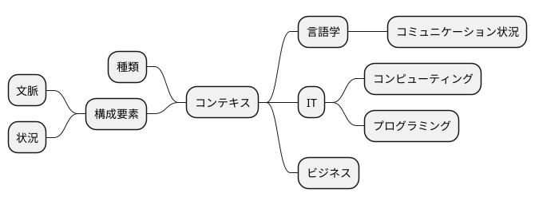

> コンテキストはこれらの原則の中で最もわかりにくいものだが、実は最も根本的なものである。
>
> エリック・エバンスのドメイン駆動設計


> コンテキストこそが重要
> コンテキストは王様である。DDDを実践する際には、特にそれがいえる。
>
> 実践ドメイン駆動設計

---

### 種類

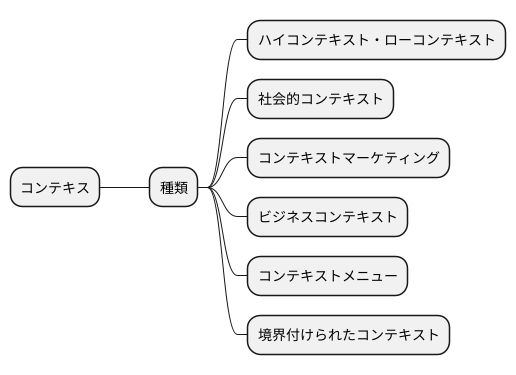

- ハイコンテキストとは互いに大きな共通理解を持っている状態。
- ローコンテキストとは互いに共通理解が少なく、全ての物事を明確に表現する必要がある状態。
- 社会的コンテキストは他の人の言動や思考を理解し、自分の考えや意図を相手に理解してもらえる環境。
- コンテキストマーケティングとは、マーケティングに取り入れられる１つの考えで、費者の目線から背景事情、思考を読み取ってマーケティング活動を行うこと。
- コンテキストメニューはソフトウェアの操作メニューを表示させる方法で、選択している操作対象に合わせてメニュー項目が変化するプログラムです。

---

### 構成要素

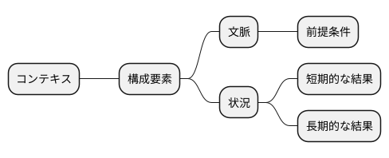

---

#### 文脈

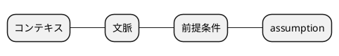

- コンテキストは、明示的または暗黙の前提を指す。
- コンテキストは、言葉では伝わりにくいまたは言語化が難しい概念を指す。

> このような「当然正しい」と考えられている事柄をー明言されていようといまいとー英語ではアサンプション(assumption)と言います。
>
> — 論理的に考える方法 小野田博一（著）日本実業出版社

---

##### プログラマのコンテキスト

XP(エクストリームプログラミング)

JTC(ジャパニーズトラディショナルカンパニー)

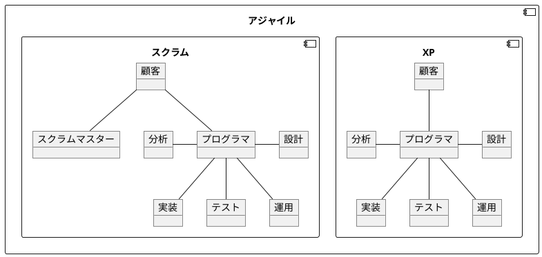

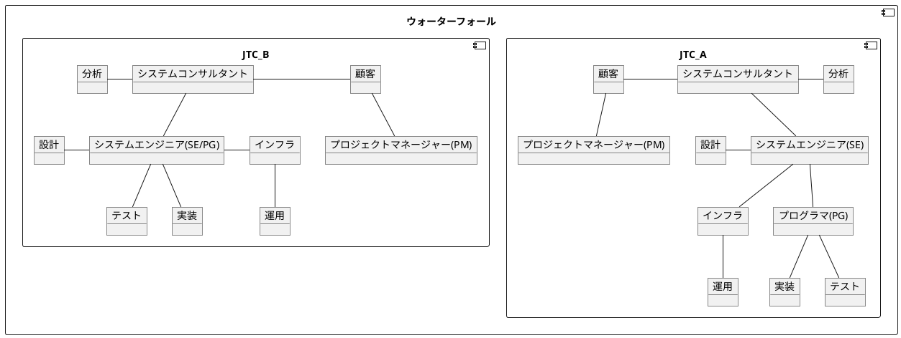

---

##### 設計のコンテキスト


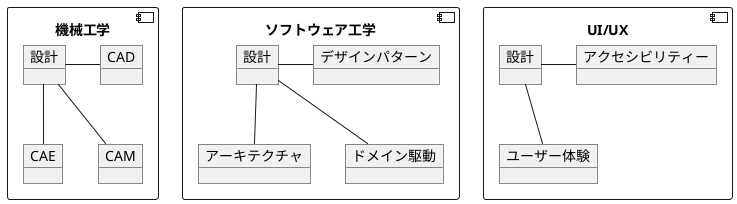

---

#### 状況

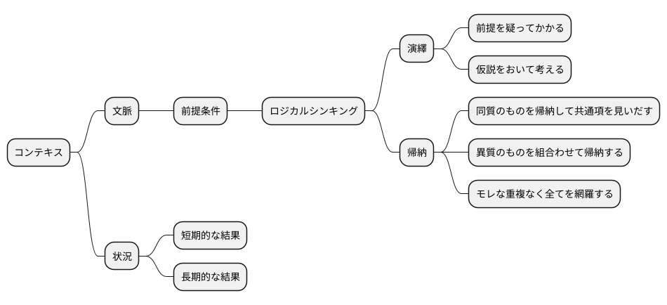

> コンテキストは何か?
> あらゆるものごとは特定のコンテキスト内で発生します。このため「万能の解決策」などというものは存在ません。「ベストプラクティス」と銘打たれた記事や書籍を考えてみてください。ここで考えるべき質問は「誰にとってベストなのか？」です。前提条件は何で、短期的な結果と長期的な結果は何でしょうか？
>
> 達人プログラマー

---

- 「要はバランス」-> 「コンテキストに依存する」
- 「コンテキストに依存する」-> 暗黙・明示的前提に依存する -> ロジカルシンキング・クリティカルシンキングの適用

##### 演繹

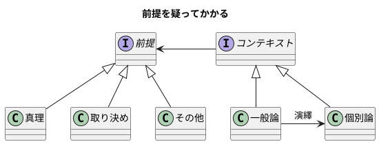


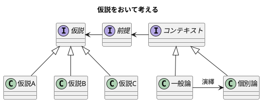

---

##### 帰納

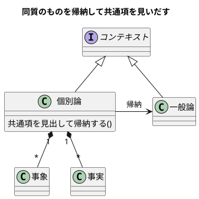

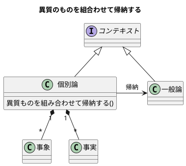

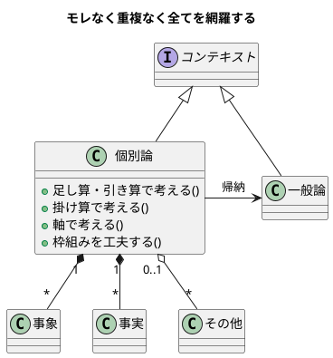

---

- 「コンテキストに依存する」-> 言語化が難しい概念に依存する -> ドメイン駆動設計の適用

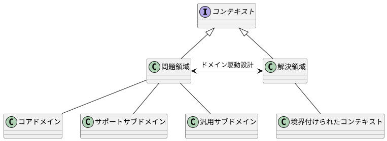

---

### 具体例

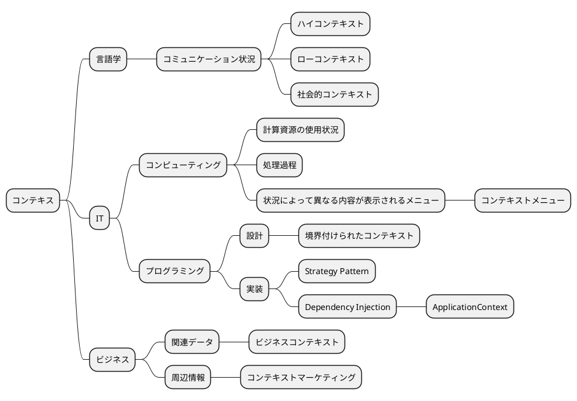

> コンテクストあるいはコンテキスト（英: context）は、一般的に「文脈」や「状況」といった意味を持つ英語[1]であり、専門分野では次のような用語や修飾語として使われることがある。
>
>言語学
>コンテキスト (言語使用) - 言語使用、言語変種、談話要約に影響を与えるコミュニケーション状況の関連する制約。
>
> コンピューティング
> コンテキスト (計算機科学) - 計算機科学（情報工学）におけるコンテキストは、何らかのタスクによって使用されるデータの最小セットである。タスクによる計算資源の使用状況などを意味する。
コンテキストスイッチ - プロセスやスレッドの状態を保存したり、後の時点で保存した状態を復元して実行を再開したりすることを可能にするための処理過程。
コンテキストメニュー - グラフィカルユーザーインターフェイス（GUI）において、クリックなどのユーザー操作が実行された状況（位置やタイミングなど）によって異なる内容が表示されうるメニュー。
コンテキストアウェアネス - 世の中の情況を捉える技術や、それらに関する概念。
>
> [Wikipedia](https://ja.wikipedia.org/wiki/%E3%82%B3%E3%83%B3%E3%83%86%E3%82%AF%E3%82%B9%E3%83%88)

> コンテキスト（context）とは、文脈、前後関係、事情、背景、状況などの意味を持つ英単語。ITの分野では、利用者の意図や状況、環境などの総体を表したり、同じ処理や記述でも状況に応じて動作などが異なる場合に、その選択基準となる判断材料や条件などを指す場合が多い。
>
> [IT用語辞典 e-Words](https://e-words.jp/w/%E3%82%B3%E3%83%B3%E3%83%86%E3%82%AD%E3%82%B9%E3%83%88.html)

> context
>
> The setting in which a word or statement appears that determines its meaning. Statements about a model can only be understood in a context.
> (単語や文が現れる設定は、その意味を決定します。モデルについての発言は、コンテキスト内でのみ理解することができます。)
>
> Domain-Driven Design Reference

---

#### プログラミング

##### Strategy Pattern

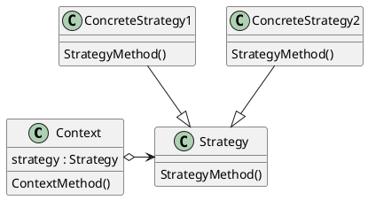

##### Dependency Injection

Spring Framework

```java
public static void main(final String[] args) {
	MessageSource resources = new ClassPathXmlApplicationContext("beans.xml");
	String message = resources.getMessage("argument.required",
		new Object [] {"userDao"}, "Required", Locale.UK);
	System.out.println(message);
}
```

##### 境界付けられたコンテキスト

> 言葉の意味が一意に決まる範囲を明確にするための設計手法が境界付けられたコンテキストです。１つの言葉に２つの意味があるならば、コンテキストを分けて、２つのユビキタス言語を作ります。つまり、モデルが２つに分かれます。
>
> Software Design 2024年3月号 ドメイン駆動設計[実践]ガイド


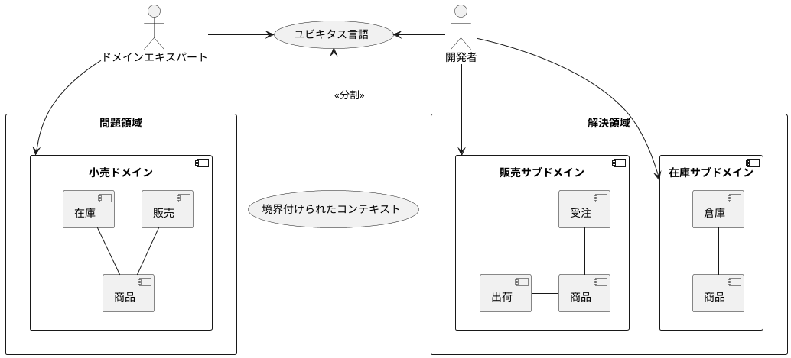

---

#### ビジネス

> ビジネスコンテキストとは
>
> 「ビジネスコンテキスト」とは、ビジネスの世界における関連データや周辺情報のことである。物事を判断・決定する際の根拠となる主な情報に関連する、言葉では伝わりにくい背景やデータのことをいう。クライアントが明確に発しない言葉の背景や意図、これまでの経緯も「ビジネスコンテキスト」と呼ばれる。
> [weblio](https://www.weblio.jp/content/%E3%82%B3%E3%83%B3%E3%83%86%E3%82%AF%E3%82%B9%E3%83%88)


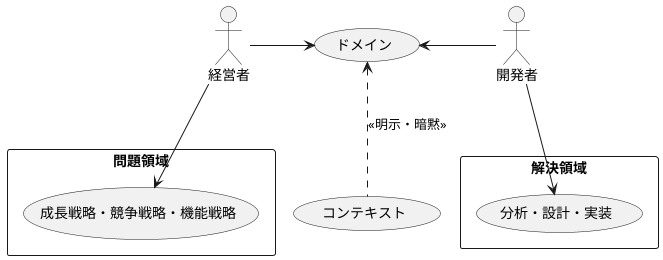

---

## まとめ

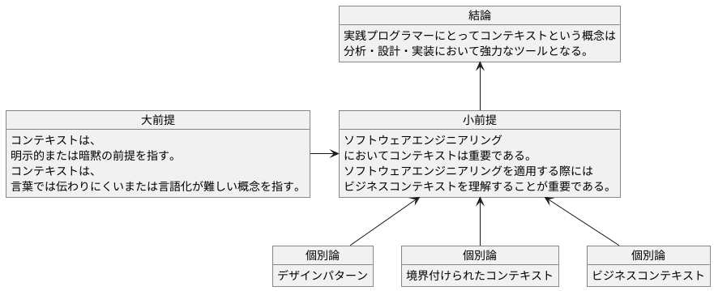

---

## 参考文献

- [達人プログラマー(第2版): 熟達に向けたあなたの旅](https://www.amazon.co.jp/%E9%81%94%E4%BA%BA%E3%83%97%E3%83%AD%E3%82%B0%E3%83%A9%E3%83%9E%E3%83%BC-%E7%AC%AC2%E7%89%88-%E7%86%9F%E9%81%94%E3%81%AB%E5%90%91%E3%81%91%E3%81%9F%E3%81%82%E3%81%AA%E3%81%9F%E3%81%AE%E6%97%85-David-Thomas/dp/4274226298/ref=pd_sbs_1?pd_rd_w=dGuvs&pf_rd_p=e0138d67-9e5b-487b-a2c3-be9ff3010069&pf_rd_r=FQTQBJZRDASV3DCJPQJB&pd_rd_r=400067c3-dc6c-4e86-966e-79474f3ab44f&pd_rd_wg=oB0uI&pd_rd_i=4274226298&psc=1)

- [エリック・エヴァンスのドメイン駆動設計: ソフトウェアの核心にある複雑さに立ち向かう](https://www.amazon.co.jp/%E3%82%A8%E3%83%AA%E3%83%83%E3%82%AF%E3%83%BB%E3%82%A8%E3%83%B4%E3%82%A1%E3%83%B3%E3%82%B9%E3%81%AE%E3%83%89%E3%83%A1%E3%82%A4%E3%83%B3%E9%A7%86%E5%8B%95%E8%A8%AD%E8%A8%88-Architects%E2%80%99Archive-%E3%82%BD%E3%83%95%E3%83%88%E3%82%A6%E3%82%A7%E3%82%A2%E9%96%8B%E7%99%BA%E3%81%AE%E5%AE%9F%E8%B7%B5-%E3%82%A8%E3%83%AA%E3%83%83%E3%82%AF%E3%83%BB%E3%82%A8%E3%83%B4%E3%82%A1%E3%83%B3%E3%82%B9/dp/4798121967/ref=pd_sbs_d_sccl_3_1/356-2306096-5319855?pd_rd_w=L5FmH&content-id=amzn1.sym.2e3b388a-4d35-4ac5-b8d6-fcf3da7dd6b4&pf_rd_p=2e3b388a-4d35-4ac5-b8d6-fcf3da7dd6b4&pf_rd_r=1NKHNP8T44XBXG9PDCSS&pd_rd_wg=jnTGw&pd_rd_r=a2b4fe7c-4a86-4951-9671-c1d187bbbd44&pd_rd_i=4798121967&psc=1)

- [実践ドメイン駆動設計](https://www.amazon.co.jp/%E5%AE%9F%E8%B7%B5%E3%83%89%E3%83%A1%E3%82%A4%E3%83%B3%E9%A7%86%E5%8B%95%E8%A8%AD%E8%A8%88-%E3%83%B4%E3%82%A1%E3%83%BC%E3%83%B3%E3%83%BB%E3%83%B4%E3%82%A1%E3%83%BC%E3%83%8E%E3%83%B3-ebook/dp/B00UX9VJGW/ref=sr_1_5?__mk_ja_JP=%E3%82%AB%E3%82%BF%E3%82%AB%E3%83%8A&crid=1T53TNE006CFM&dib=eyJ2IjoiMSJ9.dQZNgmi1PxWGA58xomliOWakWkdl5tkC6dv8PiuW7vgD91AlcpaPQpDTJGUzR5gq0h2DqLHLUT8dY21yCmYO2SEcBrhW8OW9IIFg1FjrN8jDfKJ3vQa2QyC-LFsLYzXghNPmM3tEiOhPeRha35MSx6SPph5NBydJPU0I1dYOR3Ww3-KF0m5i-HvLPZzuc06RDYlPAOFxOavhEc41pRXNLQx1Fmy_Z0041KzlFB0sM26pC8948Bq2hSmUQk8uG2cW7Zi-fjNr-YAVkEnHCfHffDOJRUM2tLIrrZGBWZvYQx4.JnxcYwYUIAGuR4_bows39c1A4KsIE4B3LOfTaqeYN84&dib_tag=se&keywords=%E3%83%89%E3%83%A1%E3%82%A4%E3%83%B3%E9%A7%86%E5%8B%95&qid=1713153002&sprefix=%E3%83%89%E3%83%A1%E3%82%A4%E3%83%B3%E9%A7%86%E5%8B%95%2Caps%2C163&sr=8-5)

- [Domain-Driven Design Reference](https://www.domainlanguage.com/wp-content/uploads/2016/05/DDD_Reference_2015-03.pdf)

- [Bounded Context](https://martinfowler.com/bliki/BoundedContext.html)

- [Software Design 2024年3月号](https://gihyo.jp/magazine/SD/archive/2024/202403)