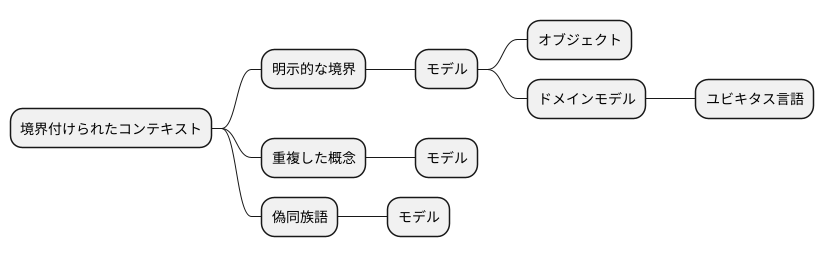
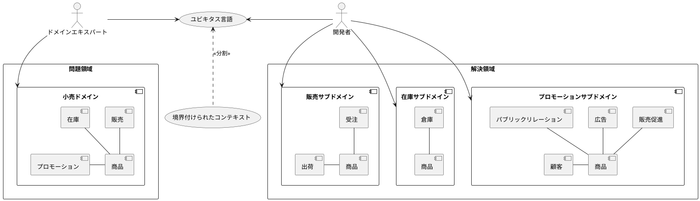
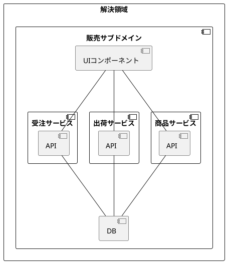
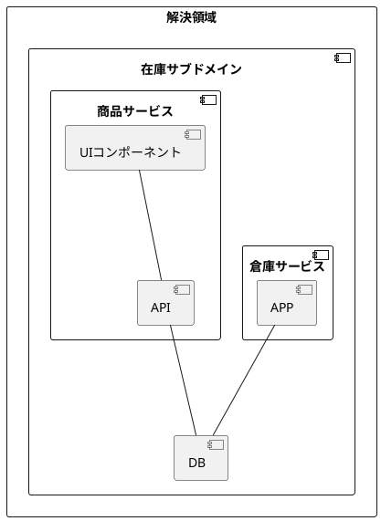
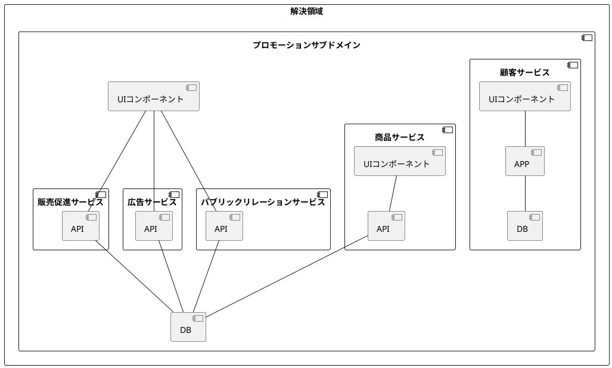
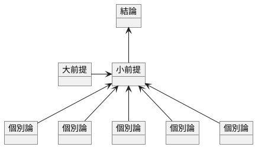

---
marp: true
---

# 実践プログラマー 境界付けられたコンテキスト

すごい広島 IT初心者の会

---

## 構成

- 自己紹介
- コンテキス
- まとめ

---

## 自己紹介

カキギカツユキ

ネット通販の会社で業務システムの開発運用してます
あと、売掛金・買掛金管理業務してます
ぼっち情シスです
クソザコトレーダーです

---

## 境界付けられたコンテキスト

> モデルが適用されるコンテキストを明示的に定義すること。明示的な境界は、チーム編成、そのアプリケーションに特有の部分が持つ用途、コードベースやデータベーススキーマなどの物理的な表現などの観点から設定すること。ただし、境界の外部の問題によって注意を逸らされたり、混乱させられたりするのを避けること。
>
> エリック・エバンスのドメイン駆動設計

> 別々のモデルの要素が組合わせると、２種類の問題が生じる。それが、重複した概念と偽同族語(false cognate)だ。
>
> エリック・エバンスのドメイン駆動設計

> bounded context
>
> A description of a boundary (typically a subsystem, or the work of a particular team) within which a particular model is defined and applicable.
> (特定のモデルが定義され、適用される境界（通常はサブシステムや特定のチームの作業）の説明。)
>
> Domain-Driven Design Reference

> 忘れてはいけない。境界づけられたコンテキストは明示的な境界であり、ドメインモデルがどこに属するかを表すものである。ドメインモデルは、ユビキタス言語をソフトウエアモデルとして表したものだ。境界を設ける理由は、各モデルの内部的な概念やプロパティ・操作がそれぞれ特別な意味をもつからだ。
>
> 実践ドメイン駆動設計

> それぞれ明確に異なる二つのモデルが、同じ（あるいはよく似た）名前のオブジェク違う意味で使っていることも多い。二つのモデルを明確に境界付けておけば、それぞれのコンテキストにおける意味合いがはっきりする。したがって、境界付けられたコンテキストは主として言語的な境界となる。これらの論点を試金石とすれば、あなたが境界付けられたコンテキストを正しく活用できているかどうかを判断できる。
>
> 実践ドメイン駆動設計

> 言葉の意味が一意に決まる範囲を明確にするための設計手法が境界付けられたコンテキストです。１つの言葉に２つの意味があるならば、コンテキストを分けて、２つのユビキタス言語を作ります。つまり、モデルが２つに分かれます。
>
> Software Design 2024年3月号 ドメイン駆動設計[実践]ガイド

>
> Bounded Context is a central pattern in Domain-Driven Design. It is the focus of DDD's strategic design section which is all about dealing with large models and teams. DDD deals with large models by dividing them into different Bounded Contexts and being explicit about their interrelationships.
> (Bounded Contextは、ドメイン駆動設計の中心的なパターンです。これは、大規模なモデルとチームを扱うためのDDDの戦略設計セクションの焦点です。DDDは、大規模なモデルを異なるBounded Contextに分割し、それらの相互関係を明示することで対処します。)
>
> martin fowler

## まとめ

