# 戦略的設計の３つの基本原則（コンテキスト、蒸留、大規模な構造）

## コンテキスト

> コンテキストはこれらの原則の中で最もわかりにくいものだが、実は最も根本的なものである。
>
> エリック・エバンスのドメイン駆動設計

> 理想的な世界なら、エンタープライズの全ドメインに広がる１つだけのモデルが手に入るかもしない。このモデルは統一されていて、用語の定期に矛盾も重複もなく、ドメインに関するあらゆる論理的な声明が一貫していることだろう。
> しかし、巨大なシステム開発の世界は理想と違う。エンタープライズシステム全体で、そのレベルの統一を維持するには苦労が多いが、その割に得られるものはすくない。
>
> エリック・エバンスのドメイン駆動設計

> 巨大なシステム向けのドメインモデルを完全に統一することは、現実的ではないし、コストにも見合わない。
>
> エリック・エバンスのドメイン駆動設計

> エンタープライズ全体のための統一モデルを維持するのが現実的ではないとしても、我々にできることがないわけではない。何を統一すべきかについての前向きな意思決定と、何を統一しないでおくかについての現実に即した認識を組み合わせることで、置かれている状況に関する明確な全体像を共有できる。この全体像があれば、確実に統一したい部分を統一する方向に向けつつ、統一しない部分のせいで混乱や破損が生じないようにすることに着手できる。
> さまざまなモデル間の境界と関係性をはっきりさせる方法が必要である。戦略を意識的に選択し、その後は、一貫してその戦略に従わなければならない。
>
> エリック・エバンスのドメイン駆動設計

> すべてはプロジェクトの現在の領域をマッピングするところから始まる。境界づけられたコンテキストによって、各モデルを適用できる範囲が定義され、コンテキストマップによって、プロジェクトのコンテキストと、それらコンテキスト間の関係性を全体的に概観できるようになる。
>
> エリック・エバンスのドメイン駆動設計


### 境界づけられたコンテキスト(Bounded Context)

> 複数のモデルはどんな巨大なプロジェクトにも存在する。だが、別々のモデルに基づくコードが組み合わされると、ソフトウエアは、バグの温床となり、信頼できなくなり、理解しにくくなる。チームメンバ間のコミュニケーションは混乱を始める。あるモデルをどのコンテキストで適用すべきでないかについては、ほとんどの場合不明瞭である。
>
> エリック・エバンスのドメイン駆動設計

> モデルが適用されるコンテキストを明示的に定義すること。明示的な境界は、チーム編成、そのアプリケーションに特有の部分が持つ用途、コードベースやデータベーススキーマなどの物理的な表現などの観点から設定すること。ただし、境界の外部の問題によって注意を逸らされたり、混乱させられたりするのを避けるｋと。
>
> エリック・エバンスのドメイン駆動設計

> 別々のモデルの要素が組合わせると、２種類の問題が生じる。それが、重複した概念と偽同族語(false cognate)だ。
>
> エリック・エバンスのドメイン駆動設計

### 継続的な統合(Continuous Integration)

> 多くの人々が同一の境界づけられたコンテキストで作業していると、モデルが分裂する傾向は強くなる。チームが大きければ大きいほど、問題も大きくなるが、３，４人ほどの少人数でも深刻な問題に直面することがある。しかし、システムをさらに小さいコンテキストに分割してしまうと、結局は有益なレベルで統合し、一貫させることができなくなる。
>
> エリック・エバンスのドメイン駆動設計

> 最も純粋なかたちのXPは、単一の境界づけられたコンテキスト内でモデルの整合性を維持するのに適している。
>
> エリック・エバンスのドメイン駆動設計

> すべてのコードと他の実装成果物を頻繁にマージさせるプロセスを策定すること。その際、分裂に対して素早く警告する自動化されたテストも一緒に用いること。ユビキタス言語の執拗な鍛錬を絶え間なく行い、モデルに対する共有された見方を練り上げること。概念は、別々の人の頭の中で進化して行くからだ。
>
> エリック・エバンスのドメイン駆動設計

### コンテキストマップ(Context Map)

> 境界づけられたコンテキスト間でもコードの再利用は、危険なので避けるべきである。
>
> エリック・エバンスのドメイン駆動設計

> プロジェクトで機能しているモデルをそれぞれ識別して、その境界付けられたコンテキストを定義すること。これには、非オブジェクト指向のサブシステムにあたる暗黙的なモデルも含まれる。境界づけられたコンテキストそれぞれに名前をつけ、その名前をユビキタス言語の一部にすること。
> モデル同士の接点を記述して、あらゆるコミュニケーションで必要となる明示的な変換について概略を延べ、共有するものがあれば強調すること。
> まず、「現在存在する」領域の地図を書くこと。変換にはその後で取りかかること。
>
> エリック・エバンスのドメイン駆動設計

> ここでの重要なポイントは２つしかない。
>
> 1. 境界づけられたコンテキストには、それについて話ができるように、名前がなければならない。その名前は、チームのユビキタス言語に加えなければならない。
>
> 2. 全員がどこに境界があるかを知っていなければならず、コードのどの一部をとっても、あるいはどんな状況にあっても、そのコンテキストを認識できなければならない。
>
> エリック・エバンスのドメイン駆動設計

### 共有カーネル(Shared Kernel)

### 顧客/供給者の開発チーム(Customer/Supplier Development Team)

### 適応者(Conformist)

### 腐敗防止層(Anticorruption Layer)

### 別々の道(Separate Ways)

### 公開ホストサービス(Open Host Service)

### 公表された言語(Published Language)

## 蒸留

### コアドメイン(Core Domain)

> モデルを煮詰めること。コアドメインを見つけて、それをサポートする大量のモデルやコードから容易に区別する手段を提供すること。最も価値のある特化した概念を浮き彫りにすること。コアは小さくすること。
> 最も才能がある人をコアドメインに割り当て、そうした区分に応じて採用すること。コアに対して力を尽くし、深いモデルを見つけ出し、システムのビジョンを実現するのに十分な、しなやかな設計を開発すること。それ以外の部分への投資は、蒸留したコアをどうサポートするかによって正当化すること。
>
> エリック・エバンスのドメイン駆動設計

### 汎用サブドメイン(Generic Subdomain)

> 設計中のプロジェクトにとって動機となっていない、高凝集のサブドメインを識別すること。そうしたサブドメインから汎用的なモデルを括り出して、別のモジュールに入れること。その中に特化した要素を一切残してはならない。
> 一旦分離したら、その部分に対して継続される開発の優先順位をコアドメインより下げ、その作業にコアとなる開発者を割り当てるのを避けること（そこから得られるドメインについての知識はほとんどないからだ）。このような汎用サブドメインに対しては、既成製品による解決策や公表されているモデルの採用も検討すること。
>
> エリック・エバンスのドメイン駆動設計


> 汎用とは再利用可能という意味ではない
>
> エリック・エバンスのドメイン駆動設計


### ドメインビジョン声明文(Domain Vision Statement)

> コアドメインとそれがもたらす価値に関する簡潔な記述を作成すること（約1ページ）。これが、「価値の提議」（value proposition）である。
>
> エリック・エバンスのドメイン駆動設計

### 強調されたコア(Highlighted Core)

> 蒸留ドキュメントがコアドメインの本質を概説しているなら、それはモデルを変更する意義を示す、実用的な指標としての役割を果たす。モデルやコードの変更が蒸留ドキュメントに影響を与える場合には、他のチームメンバとの協議が必要である。変更したらチームメンバ全員に速やかに通知し、蒸留ドキュメントに含まれていない詳細に対する変更であれば、協議も通知もなしで統合することができ、他のメンバは作業の過程で気づくことになる。そうなれば、開発者はXPが提唱する完全な自律を手に入れることになる。
>
> エリック・エバンスのドメイン駆動設計

### 凝集されたメカニズム(Cohesive Mechanism)

### 隔離されたコア(Segregated Core)

### 抽象化されたコア(Abstracted Core)

> 深いモデルを生み出すブレイクスルーはどこで発生しても価値を生むが、プロジェクト全体の軌道を変えられるのは、それがコアドメインにおいて発生した時だけだ。
>
> エリック・エバンスのドメイン駆動設計


## 大規模な構造

> 「大規模な構造」は、システムをおおよその構造から議論し、理解できるようにするための言語である。
>
> エリック・エバンスのドメイン駆動設計

### 進化する秩序(Evolving Order)

### システムのメタファ(System Metaphor)

### 責務のレイヤ(Responsibility Layers)

### 知識レベル(Knowledge Level)

### 脱着可能なコンポーネントのフレームワーク(Pluggable Component Framework)

## ドメイン、サブドメイン、境界付けられたコンテキスト

> ドメインとは、広い意味で言うと、組織が行う事業やそれを取り巻く世界のことだ。
>
> 実践ドメイン駆動設計

> ほとんどのソフトウエアのドメインは、複数のサブドメインを持つ。組織の規模の大小や複雑性には関係ないし、ごく数名だけが使うソフトウエアであっても同じことだ。
>
> 実践ドメイン駆動設計
>

> 嘆かわしいことに、多くのソフトウエア開発者が「可能な限り、あらゆるものをひとつのシステムにまとめてしまうほうが賢いやりかただ」と考えている。
>
> 実践ドメイン駆動設計

> コアドメインとは業務ドメインの一部で、組織を成功に導くために最も重要なものだ。戦略的な意味において、そのコアドメインでは他を圧倒しているに違いない。
>
> 実践ドメイン駆動設計

> 業務に不可欠な内容を表しているが、まだコアドメインとはいえないようなモデルのことを、支援サブドメインと呼ぶ。
>
> 実践ドメイン駆動設計

> 業務上特別なことを特に何もしなくても、ソリューション全体として必要なドメインもある。それが汎用サブドメインだ。
>
> 実践ドメイン駆動設計

> ドメインは、問題空間と解決空間をもっている。問題空間は、解決すべきビジネス戦略上の課題を浮き彫りにするもので、もう一方の解決空間は、ソフトウエアをどのように実装してその課題を解決するかに注目するものだ。
>
> 実践ドメイン駆動設計

> 解決空間は境界付けられたコンテキストのことで、特定のソフトウエアモデルの集合となる。なぜなら、境界付けられたコンテキストは特定のソリューションを表すものであり、それを具体化したビューであるからだ。
>
> 実践ドメイン駆動設計

> コアドメインにおけるソリューションを作り出すことは、重要な設備投資であることを忘れないように！
>
> 実践ドメイン駆動設計

> 忘れてはいけない。境界づけられたコンテキストは明示的な境界であり、ドメインモデルがどこに属するかを表すものである。ドメインモデルは、ユビキタス言語をソフトウエアモデルとして表したものだ。境界を設ける理由は、各モデルの内部的な概念やプロパティ・操作がそれぞれ特別な意味をもつからだ。
>
> 実践ドメイン駆動設計


## コンテキストマップ

> コンテキストマップは、現存する地形をとらえるものだ。まずマッピングすべきは現状であり、こうあってほしいという将来の姿ではない。
>
> 実践ドメイン駆動設計

> コンテキストマップは、エンタープライズアーキテクチャやシステムトポロジー図のようなものではない。
>
> 実践ドメイン駆動設計

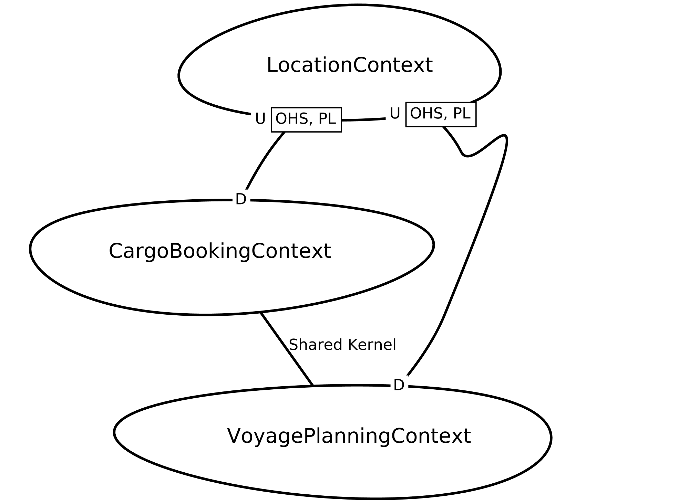

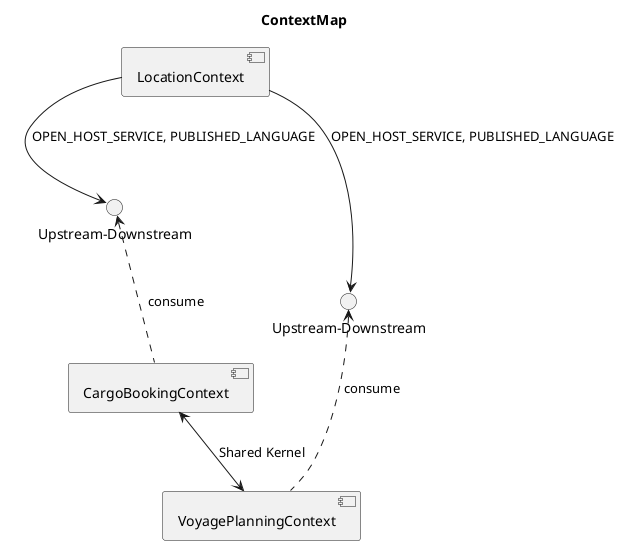


# 達人プログラマー


> 批判的な考え方
> 重要な点の最後は、あなたが見聞きするものごとについての批判的な考え方です。
> Tip 10 見聞きしたものごとを批判的な目で分析すること
>
> 達人プログラマー

> 常に批判的な目でコードを見る習慣をつけてください。コードの構造と直交性を向上させるため、どんな機会も逃さないように。こういったプロセスのことを「リファクタリング」と呼びます。
>
> 達人プログラマー

> 人を非難したり、煽ったりするのは、後々、自分に返ってくるのでやめましょう。面と向かって言わないようなことを、オンライン表現してはいけません。
>
> 達人プログラマー

> コンテキストは何か?
> あらゆるものごとは特定のコンテキスト内で発生します。このため「万能の解決策」などというものは存在ません。「ベストプラクティス」と銘打たれた記事や書籍を考えてみてください。ここで考えるべき質問は「誰にとってベストなのか？」です。前提条件は何で、短期的な結果と長期的な結果は何でしょうか？
>
> 達人プログラマー

# 論理の基本を知っておこう

なぜ論理思考が必要なのか

1. 情緒に流されやすい判断や行動を防ぎ、自分の頭で考えて、「正しい結論を導く」ことができること。
1. 文化の同一性に頼らず、どの民族にも通用する、「正しいコミュニケーションができること」こと。
1. 「発想を助け、課題の検討・解決に役立つ」こと。

数学の基本

1. 右辺と左辺を等合で結ぶ
1. 計算は+-x/(加減剰余)のルールで演算すること
1. 掛け算や割り算を足し算、引き算より先にやること
1. カッコ内を先に計算すること
1. 計算ミスをしないこと

論理の基本
> １つのメッセージ（結論）は、必ず2つ以上のサブ・メッセージ（要因）でサポートされてるため、論理は、底辺に行くほど広いピラミッド状に組み上げられる。
>
> わかる。、使える「論理思考」の本　後正武

1. 論理の基本単位は、単語ではなく主語・述語で組み上げるメッセージである。
1. メッセージを組み上げる基本構造には「演繹」と「帰納」という2つの方法がある。
1. 上位のメッセージと、それをサポートする下位のサブ・メッセージは、結論と要因、あるいは総合と部分の関係にある（メッセージの上下関係）
1. 上位のメッセージを支える下位のメッセージは、それらを総合すると、モレや重複がないこと（水平関係）
1. 全体を支える最下部のメッセージは、事実、またはそれに近い疑いようのないメッセージ（蓋然性の高いメッセージ）であること


## 論理の基本

> １つのメッセージ（結論）は、必ず2つ以上のサブ・メッセージ（要因）でサポートされてるため、論理は、底辺に行くほど広いピラミッド状に組み上げられる。
>
> わかる。、使える「論理思考」の本　後正武

1. 論理の基本単位は、単語ではなく主語・述語で組み上げるメッセージである。
1. メッセージを組み上げる基本構造には「演繹」と「帰納」という2つの方法がある。
1. 上位のメッセージと、それをサポートする下位のサブ・メッセージは、結論と要因、あるいは総合と部分の関係にある（メッセージの上下関係）
1. 上位のメッセージを支える下位のメッセージは、それらを総合すると、モレや重複がないこと（水平関係）
1. 全体を支える最下部のメッセージは、事実、またはそれに近い疑いようのないメッセージ（蓋然性の高いメッセージ）であること

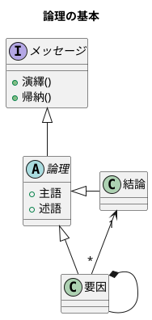


## 論理の基本構造

Deduction(演繹)は、前提となる正しいメッセージ（一般論）がまずあり、それを個別の事象に適用して、正しい主張・答を引き出す方法で「一般論」から「個別論」へという構造になっている

Induction(帰納)は、たくさんの個別の事象や主張を集めて、より一般的に通用する共通のメッセージを導き出す方法で「個別論」から「一般論」へという構造になっている

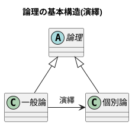

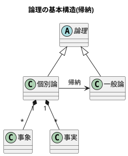

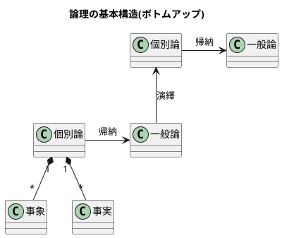

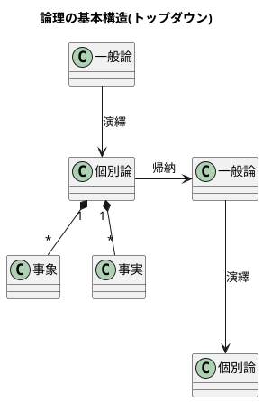

## 演繹を使いこなそう!

### 「風鈴」はロジックではない

### 前提にはいろいろな種類がある

1. いつでも常に正しいと主張できる真理
1. 人間社会が決めた取り決め
1. その他の一般に用いられる前提

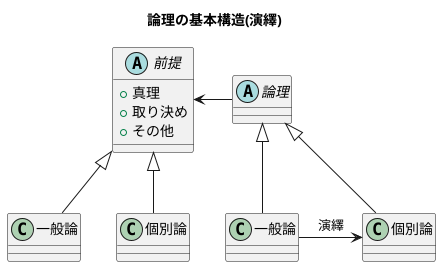


### 前提を疑ってかかる

### 前提は事実の裏付けを持って常に確かめていることが必要である

### 仮説を置いて考える

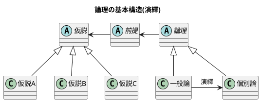

## 帰納を使いこなそう！

### 同質のものを帰納して共通項を見出す＜単純な帰納＞

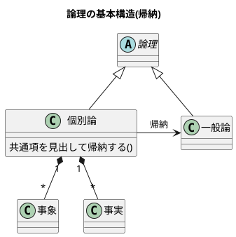

### 異質のものを組み合わせて帰納する＜複雑な帰納＞

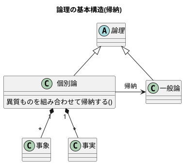

### モレなく重複なく全てを網羅する

1. 足し算・引き算で考える
1. 掛け算で考える
1. 軸で考える
1. 枠組みを工夫する

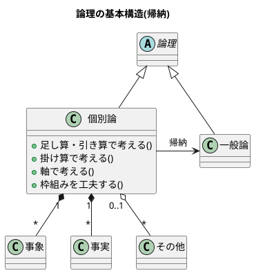

#### 足し算・引き算で考える

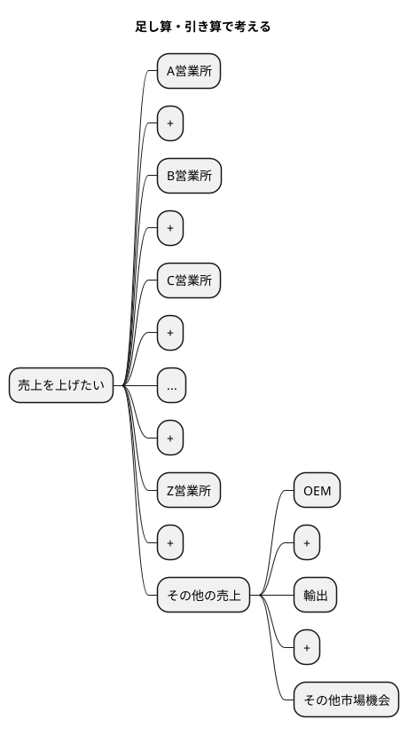

可能な全売上機会 - 現行の各営業所の売上の合計 = その他

#### 掛け算で考える

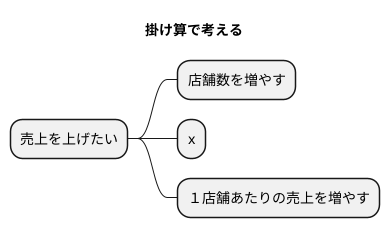

店舗数 x １店舗あたりの売上 = 全体の売上

#### 軸で考える

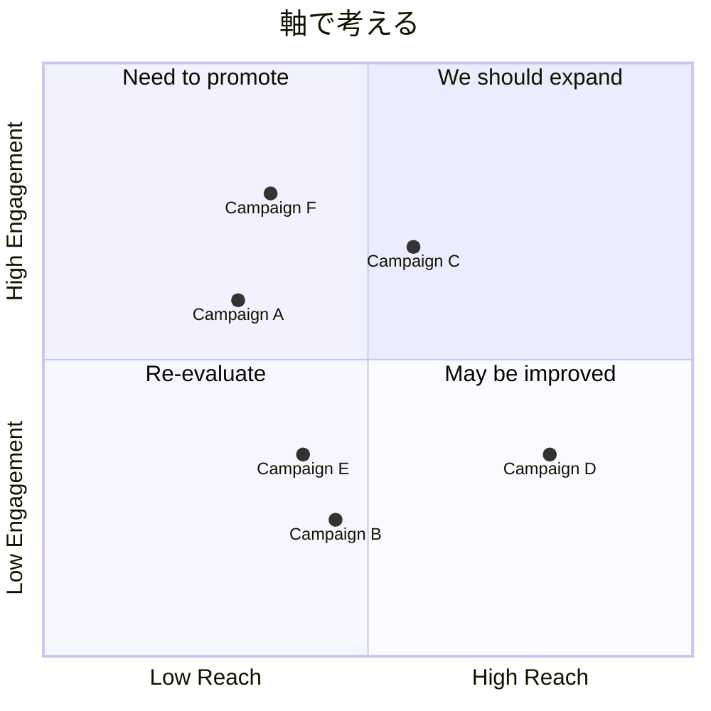


### 枠組みで考える


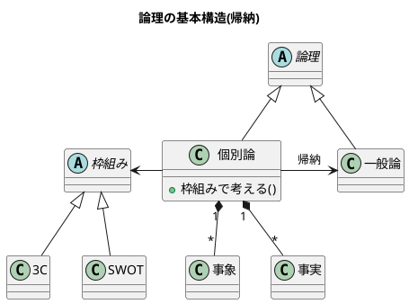

## 課題を解決しよう！

### 規準を作って比較する

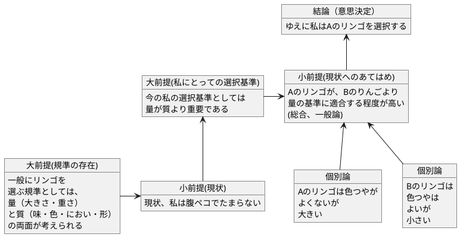

### 枠組みを考える

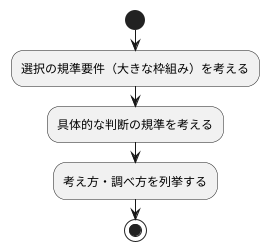

#### 志望校を決める枠組み

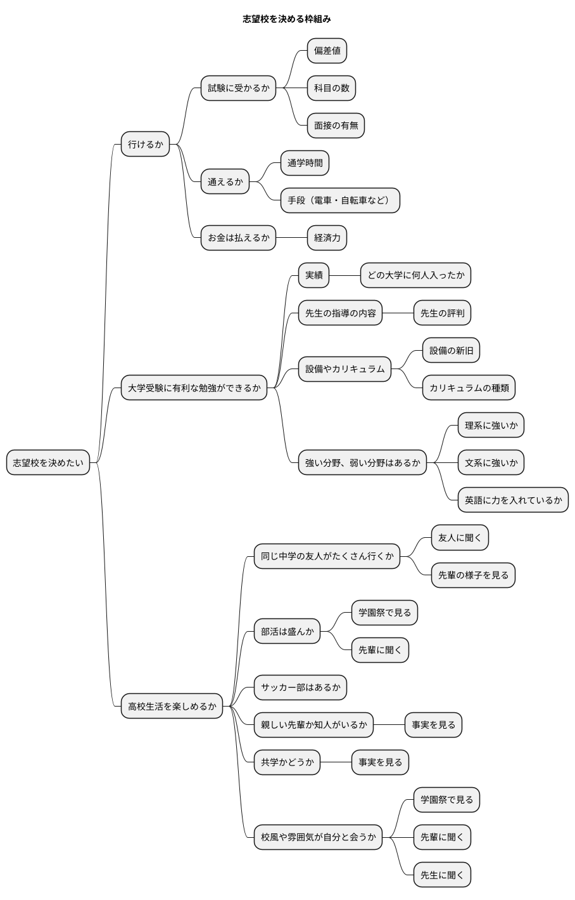

### 表を活用する

#### 志望校を決める枠組み

| 規準 | 学校A | 学校B | 学校C |
| ---- | ---- | ---- | ---- |
| 通学時間 | 30分 | 45分 | 1時間 |
| 手段 | 電車 | 自転車 | 徒歩 |
| 経済力 | 可能 | 可能 | 難しい |
| 実績 | 〇 | △ | × |
| 先生の評判 | 良い | 普通 | 悪い |
| 設備の新旧 | 新しい | 古い | 新しい |
| カリキュラムの種類 | 理系 | 文系 | 総合 |
| 強い分野 | 理系 | 文系 | 英語 |
| 高校生活 | 楽しい | 普通 | 退屈 |
| 部活 | 盛ん | 普通 | あまりない |
| サッカー部 | あり | なし | あり |
| 共学 | あり | なし | あり |
| 校風 | 自由 | 厳格 | 普通 |
|総合評価| ◎ | △ | × |


### イッシュー・ツリーを展開する

> 「１つの課題をめぐって、異なる立場から意見が対立する点」のことじゃ。
>
> > わかる。、使える「論理思考」の本　後正武

> イッシューとはイエスかノーか、なすべきかなさざるべきか、の意見が対立する政治上の問題点のことえある。
>
> > 論理的思考と発想の技術

> イッシューということばは「対立」に力点をおくよりも、「解決」に力点をおいて用いられ、その解決のための筋道を考えることが、まさにコンサルタントの日常業務となっている。
>
> > 論理的思考と発想の技術

#### ラーメン店を開くべきか否か

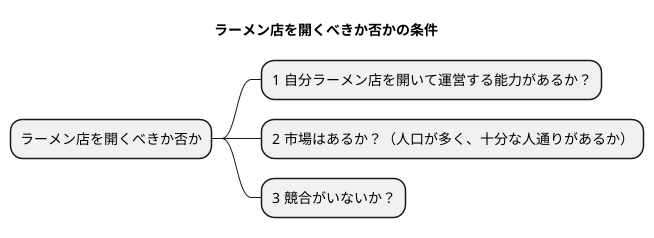

#### ラーメン店の経営が成り立つ条件

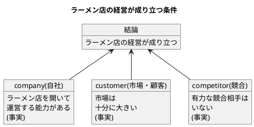

#### ラーメン店を開くかどうかのイッシュー・ツリー

```plantuml
@startmindmap
title ラーメン店を開くかどうかのイッシュー・ツリー

* ラーメン店を開くべきか否か
** ラーメン店を開いて運営する能力があるか否か(company)
*** 人がいるか
*** お金があるか
*** ラーメンをつくる技術をもっているか
*** 材料や設備は手に入るか
*** ...
*** その他ラーメン店を運営する要件を満たせるか
** 市場は十分に大きいか(customer)
*** 人口はどれだけか
*** 交通量は十分か
*** ラーメンを外食する人が期待できる構成か
** 有力な競争相手がいるか否か(competitor)
*** 競合店が近くにあるか
**** ある場所、距離は十分に遠いか
**** 味・店構え・ロケーションなど自分に比べて優位か否か
*** ラーメン以外の外食店があるか、どんな店か
*** (競合がある場合)集客などかえって相乗効果を期待することはできないか
@endmindmap
```


### 数学の考え方を援用する

#### 売上を上げるための考え方

```plantuml
@startuml
object "売り上げが低下した" as A 
object "売上を上げれるか" as B 

A -> B
@enduml
```

#### 足し算・引き算で考える

```plantuml
@startmindmap
title 足し算・引き算

* 地域等で分ける
** 札幌営業所の売上を上げられるか
** 仙台営業所の売上を上げられるか
** 北関東営業所の売上を上げられるか
** 東京営業所の売上を上げられるか
** ...
** その他、売上を上げらる機会はないか
*** 輸出
*** OEM
*** 他チャネル

@endmindmap
```

#### 掛け算で考える

```plantuml
@startmindmap
title 掛け算


+ x
-- 店舗数
--- 増やせるか
---- 交通量・ロケーションの特徴
---- 人口密度・地域需要
---- 基本エコノミクスの構造など
++ １店舗あたりの売上
+++ 客数を増やせるか
++++ キャンペーン・特売
++++ 広告・ちらし
++++ 店構え・その他
+++ x
+++ 客単価を増やせるか
++++ 品揃え
++++ レイアウト
++++ セット販売
++++ その他

@endmindmap
```

#### 要素・枠組みで考える

```plantuml
@startmindmap
title 要素・枠組み

* 売上が低下した理由の検討
** 全国共通の要因はあるか 
*** 全国共通の製品・価格・マーケティング施策等の工夫
** 個店別の要因が大きいか
*** 業績低下の大きい店への個別指導等
** 季節性の課題が大きいか
*** 冬に売れる商品の開発（冬に低下なら）
** その他

@endmindmap
```


# 論理と「論理的」について

> 高い論理性を身につけるとは、「結論」と「結論を支えるもの」の関係について正確な理解を獲得することなのです。
>
> 論理思考力を鍛える本 小野田博一

> 高い倫理性とは、結論と前提との関係の理解度が高く、理解している通りにそれを実践の場で使えることなのです。
>
> 論理思考力を鍛える本 小野田博一

## 論理の世界の用語

結論と前提の両方を含んだスティトメント(statement)をアーギュメント(argument)といいます。
「ロジック」（論理）は、結論と前提を繋ぐ無形のものです。この無形の部分はインファランス(inference)ともいいます。インファランスには2種類のものがあります。ディダクティブ・インファランス（deductive inference）とインダクティブ・インファランス（inductive inference）です。

前提から結論を導く思考のことをリーズニング（reasoning）といいます。

ディダクティブ・インファランスの評価は、valid/invalidで与えられます。validは「論理が正しい」の意味で、invalidは「論理が正しくない」の意味です。

インダクティブ・インファランスの評価は、strong/weakで与えられます。インダクティブ・インファランスは「たぶんどうだろうか」の推論なので、前提が正しくとも、得られた結論が100%確実に正しいと断言できません。

論理が正しいだけでなく、前提も（真実か否かの点から）正しい場合、評価はsoundで与えられます。

### 日本語との対応

- inference
  - deductive inference 1
  - inductive inference 2 - 4

1. カモノハシは哺乳類である。したがって、カモノハシは、哺乳類か鳥類である。
2. 私がこれまでに食べたレモンは、どれもすっぱかった。だからレモンはどれもすっぱいだろう。
3. メガネをかけている高校生の女の子のうち、90%のメガネは黒縁である。紀子は高校生で、メガネをかけている。だから、それはたぶん黒縁だろう。
4. 春にピンクのスカートが流行した年の夏に、白い水着が流行した。ことしの春はピンクのＴシャツが流行しているから、夏には白い水着が流行するだろう。

1は日本語では演繹とよばれています。2,3,4は日本語では帰納とよばれていますが日本語で帰納といえば、一般的に2の一般化を指すようです。1から4まではinferenceでこの訳語は推論ですが、日本語の推論の語の意味は、通常、1の演繹をさすので、推論はinferenceの訳語としては適切ではないようです。
なお、2-4のタイプ名は2は一般化、3は統計的帰納、4は類推です。

### 必要条件・十分条件

必要条件

AであるためにはBである必要がある（たとえば、「ペンギンであるためには、鳥である必要がある」）
BであることはAであることの必要条件である（たとえば「鳥であることはペンギンであることの必要条件である」）

```plantuml
component  {
	object B
	component  {
		object A 
	}
}
B --> A : 必要条件
```

十分条件

BであるためにはAであれば十分である（たとえば、「鳥であるためには、ペンギンであれば十分である」）
AであることはBであることの十分条件である（たとえば「ペンギンであることは鳥であることの十分条件である」）

```plantuml
component  {
	object B
	component  {
		object A
	}
}
B <-- A : 十分条件
```


> ロジック（logic）とは、論理、論法、理屈、理路などの意味を持つ英単語。一般の外来語としては、理屈、論拠、話の道筋などを表すことが多い
>
> プログラミングでは、処理の流れや手順、プログラムが体現する論理のことをロジックという場合がある。ある特定の問題を解く手順を、単純な計算や操作の組み合わせとして定義した「アルゴリズム」（algorithm）とほぼ同じ意味で用いられる
>
> [IT用語辞典 e-Words](https://e-words.jp/w/ロジック.html)

>  ステートメント（statement）とは、発言、声明、宣言、供述、提示、報告書、明細書などの意味を持つ英単語。IT分野ではプログラムを構成する個々の文のことをステートメントということが多い。
> プログラミングの分野では、コンピュータプログラムの構成単位となる、一つ一つの手続きや命令、宣言などのことをステートメントという。日本語では「文」と訳される。複数のステートメントを一つの文のように扱えるようまとめたものを「コードブロック」あるいは「複文」という。
>
> [IT用語辞典 e-Words](https://e-words.jp/w/%E3%82%B9%E3%83%86%E3%83%BC%E3%83%88%E3%83%A1%E3%83%B3%E3%83%88.html#:~:text=%E3%83%97%E3%83%AD%E3%82%B0%E3%83%A9%E3%83%9F%E3%83%B3%E3%82%B0%20%E3%81%AE%E5%88%86%E9%87%8E%E3%81%A7%E3%81%AF%E3%80%81,%E3%82%B3%E3%83%B3%E3%83%94%E3%83%A5%E3%83%BC%E3%82%BF%E3%83%97%E3%83%AD%E3%82%B0%E3%83%A9%E3%83%A0%20%E3%81%AE%E6%A7%8B%E6%88%90%E5%8D%98%E4%BD%8D%E3%81%A8%E3%81%AA%E3%82%8B%E3%80%81%E4%B8%80%E3%81%A4%E4%B8%80%E3%81%A4%E3%81%AE%E6%89%8B%E7%B6%9A%E3%81%8D%E3%82%84%E5%91%BD%E4%BB%A4%E3%80%81%E5%AE%A3%E8%A8%80%E3%81%AA%E3%81%A9%E3%81%AE%E3%81%93%E3%81%A8%E3%82%92%E3%82%B9%E3%83%86%E3%83%BC%E3%83%88%E3%83%A1%E3%83%B3%E3%83%88%E3%81%A8%E3%81%84%E3%81%86%E3%80%82)


> 引数（argument）とは、プログラム中で関数やメソッド、サブルーチンなどを呼び出すときに渡す値のこと。渡された側はその値に従って処理を行い、結果を返す。オペレーティングシステム（OS）の操作などで利用者がコマンドを実行する際に指定するパラメータ（コマンドライン引数）などを指すこともある。
>
> [IT用語辞典 e-Words](https://e-words.jp/w/%E5%BC%95%E6%95%B0.html)

> バリデーション（validation）とは、検証、実証、認可、妥当性確認などの意味を持つ英単語。ITの分野では、対象がその仕様や文法などに照らして適切に記述・構築されているか否かを検証するという意味で用いられることが多い。
>
> [IT用語辞典 e-Words](https://e-words.jp/w/%E3%83%90%E3%83%AA%E3%83%87%E3%83%BC%E3%82%B7%E3%83%A7%E3%83%B3.html)


## 「ロジカル（論理的）」とは何か

> 「実生活の議論（のうち演繹）では、validであるだけでは十分ではなく、soundでなければならない」ということで、つまり、「前提は真実でなければならない」ということです。

## 批判的に読み、批判的に聞く

> 実生活の場において、読むとき、聞くときに行っている（行うべき）「批判的に読み、批判的に聞く」ための思考を、クリティカル・シンキングと言います。

> 「実生活の場で、論理が正しいのか、前提は正しいのか、の2点を考える」とは言い換えると、「アーギュメントを鵜呑みにせず、アーギュメントの正しさを自力で考える」ことです。

## 「もっともらしさ」

> 実生活では、断言できないことがとてもたくさんあります。私たちが話したり書いたりする内容は、ほとんど断言できないことばかりです。そのため、「もっともらしさ」は実生活では大きな役割を果たす事になります。
> そして、クリティカル・シンキンキングは、「もっともらしさ」をあなた自身が検証する事なのです。

## 議論では、もっともらしさを高めるよう努力せよ

> 人を納得させるのは「真実」ではなく「真実らしさ」（もっともらしさ）です。

## 実生活の（理に適っていない）議論と省力

> 前提が明言されていない場合は、「それは言うまでもないこと」と考えられて通常、省力されている訳ですが、このような「当然正しい」と話し手・書き手が考えている事柄をー明言されていようといまいとー英語ではアサンプション(assumption)と言います。	

> 述べられた発言や記述がロジカルか否か（理に適っているか否か）を判断するためには、実際に述べられている部分について正しいか否かを判断するだけでなく、省力されている部分に対しても、正しいか否かを考えねばなりません。

> さらに、「述べてしまうとまずい部分（議論の弱点を自ら晒してしまう部分）」は、実生活の議論では必ず（意識的に、あるいは無意識に）省略されるので、なおさら、「省略されている部分を見落とさない」が大切なのです。

# クリティカル・シンキング

## クリティカル・シンキングのポイント

> なぜクリティカル・シンキングが必要なのかと言えば、それは、読み聞きした内容で「相手のいいように操られないため」「間違った判断を下さないため」です。

> クリティカル・シンキンキングのポイントは「むやみに信じないこと」です。つまり「信じるにたる根拠がないかぎり信じるな」です。

> 「自分自身の判断力を使って判断する」とは、「前提と結論のつながりの正しさや支えかたの強度」を自分自身で判断することで、具体的には、結論が正しく導き出されているか、しっかり支えられているか、および情報そのものの信頼性を考えることです。

## クリティカル・シンキングの手順

1. 結論を見つけよ
1. 支えている（つもりの）ものを見つけよ
1. 支えているつもりのものの信頼性を判断せよ
1. 支えているつもりのものが十分支えているかー支えている程度の十分さを調べよ
   1. 隠れているアサンプションがある？
	 1. アサンプションは正しい？

## クリティカル・シンキングの2つのコツ

1. 隠れているアサンプションが何かを考えよ
1. リーズニングのフォーム（形式）を考えよ

> 日常的には、多くの場合、発言が論理的か否かはアサンプションが正しいか否かにかかっています。

## アーギュメントの欠陥

- 早まった一般化
- 原因・結果の間違い
- 間違った類比
- 権威の間違った使用
- あいまいな表現
- 立証責任の転嫁
- 循環論法
- 聞き手・読み手の感情の利用
- 個人攻撃
- 矛盾
- 一般の意見の使用
- 統計の悪用（歪めた使用）

## もっとも強い反論

> もっとも強い反論は、もとの議論のアサンプションをアタックする議論です。

## 説得の基本

> 説得に必要な要素は三つあります。それは
> 1 論理
> 2 感情へのアピール
> 3 信頼性
> の三つです。
> 説得をする際に重要となるのは、「説得は一方的に行うものではない。つまり、説得ではコミュニケーションに双方向性がなけらならない」という点です。


> 説得とは、人に影響を与えるという目的を持ったコミュニケーションのプロセス」と言うことができます。
>
> 論理的に説得する方法

## 説得するための５つのステップ

- ステップ1: 目標を設定する

## 批判と非難は違う

> 人を非難したり、煽ったりするのは、後々、自分に返ってくるのでやめましょう。面と向かって言わないようなことを、オンラインで表現してはいけません。
>
> — 達人プログラマー 熟達に向けたあなたの旅（第2版）

# イシュー

> issueの定義
>
> A) a matter that is in dispute between tow or more parties
> 2つ以上の集団の間で決着のついていない問題
>
> B) a vital or unsettled matter
> 根本にかかわる、もしくは白黒がはっきりしていない問題
>
>> イシューからはじめよ

## イシュードリブン - 「解く」前に「見極める」

### イシューを見極める

### 仮説をたてる

### よいイシューの３条件

- 本質的な選択肢である
- 深い仮説がある
- 答えを出せる

### イシュー特定のための情報収集

- 一次情報に触れる
- 基本情報をスキャンする
- 集めすぎない・知りすぎない

### イシュー特定の５つのアプローチ

- 変数を削る
- 視覚化する
- 最終形からたどる
- 「So What?」を繰り返す
- 極端な事例を考える

## 仮説ドリブン - イシューを分解し、ストーリーラインを組み立てる

### イシューを分解する

### ストリートラインを組み立てる

## 仮説ドリブン - ストーリーを絵コンテにする

### 軸を整理する

### イメージを具体化する

### 方法を明示する

## アウトプットドリブン - 実際の分析を進める

## メッセージドリブン - 「伝えるもの」をまとめる

### ストーリーラインを磨きこむ

- 論理構造を確認する
- 流れを磨く
- エレベーターテストに備える

### チャートを磨きこむ

- １チャート・１メッセージを徹底する
- タテとヨコの比較軸を磨く
- メッセージと分析表現を揃える